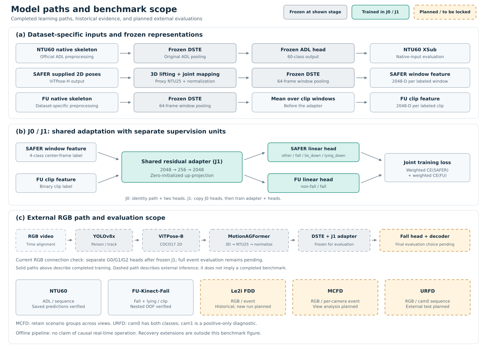

# E13 — 논문 벤치마크 구성과 결과 출처

- 문서 ID: `DOC-20260903-exp13-benchmark-provenance-R3`
- 최초 작성: 2026-09-03
- 기준일: 2026-10-02
- 상태: 현재 산출물 검산·URFD 추가 평가 `completed`; Le2i 현재 모델 평가 `planned`; MCFD `paused`
- 범위: **NTU60·FU·Le2i의 출처 검토와 URFD 추가 평가, MCFD 보류 사유를 정리한다.**

최신 실제 사례·문헌·비판적 검토는 [논문 근거 검토](2026-10-02_paper_evidence_review_shared.md)를 참조한다.

## 1. 벤치마크의 역할

데이터셋마다 확인하는 질문과 평가 단위가 다르다. 아래 결과를 하나의 평균 점수나 통합 순위로
합치지 않는다. SAFER-Activities는 학습 데이터로 계속 사용하며, 평가표를 다섯 데이터셋으로
구성한다고 학습에서 제외하지 않는다.

| 데이터셋 | 확인할 내용 | 입력과 평가 단위 | 현재 근거·상태 |
| --- | --- | --- | --- |
| NTU RGB+D 60 | 기존 60-class ADL 성능과 고정 경로 보존 | native 3D skeleton, sequence | XSub 저장 예측 검산 완료; RGB ADL 성능 아님 |
| FU-Kinect-Fall | 낙상 분류와 의도적으로 눕는 동작의 오경보 | native skeleton, clip | 993 clips의 nested OOF 결과 검산 완료 |
| Le2i FDD | 외부 RGB 입력에서의 낙상 사건 검출 | RGB, event | 과거 127편 결과 존재; 현재 모델의 새 평가 결과 없음 |
| MCFD | 동일 사건에서 카메라 시점에 따른 성능 변화 | RGB, scenario별 camera view | 영상 확보; 정답 출처 충돌로 평가 보류 |
| URFD | 외부 RGB 영상의 fall/non-fall 분류 | camera 0 RGB, sequence | 전체70개 평가 완료; F158.824%, coverage45/70; event 평가는 미실행 |

NTU/FU는 각 데이터셋 학습·평가 계약에 따른 결과이고, Le2i/MCFD/URFD는 목표 데이터셋에서
낙상 분류기를 학습하지 않는 외부 전이 평가 축이다. 따라서 FU의 모든 비교군까지
“Frozen cross-dataset evaluation”이라고 묶지 않는다.

## 2. 현재 산출물에서 확인한 정량 결과

### 2.1 NTU60 XSub

| 모델·조건 | 평가 표본 | Top-1 | Top-5 | 근거 |
| --- | ---: | ---: | ---: | --- |
| 고정 DSTE + epoch150 ADL linear head | 16,487 | 85.285% | 97.234% | 현재 저장된 정답·logits 검산 |

이 값은 공식 NTU 전처리의 native skeleton 결과다. XView 결과나 RGB-derived ADL 결과로
확대하지 않는다. 낙상 분기 학습 전후의 **출력 보존**은 같은 표본 순서의 logits·파라미터 비교로
따로 제시해야 한다. 이번 표는 기존 저장 예측을 검산한 것이며, 새 before/after 추론 검사를
수행했다는 뜻은 아니다. [NTU ADL 실험 기록](2026-09-03_01_ntu60_adl_shared.md).

### 2.2 FU: 같은 평가 표본·단위에서의 분류기 비교

21명의 993 clips 중 fall은165개, non-fall은828개이며, 의도적으로 눕는 평가 표본은168개다.
5개 subject folds를 이용한 outer evaluation과 inner selection을 사용했다. 모든 모델의 OOF
예측에서 각 clip이 정확히 한 번 평가됨을 확인했다. 지표는 fold별 F1의 단순 평균이 아니라
전체 OOF 예측을 모아 계산한 값이다.

| 모델 | 낙상 학습 데이터 | Precision | Recall | F1 | AP | Lying FP / 168 |
| --- | --- | ---: | ---: | ---: | ---: | ---: |
| Logistic regression | FU | 91.329% | 95.758% | 93.491% | 98.290% | 15 / 168 |
| Linear SVM | FU | 81.407% | 98.182% | 89.011% | 97.888% | 29 / 168 |
| RBF-SVM | FU | 93.902% | 93.333% | 93.617% | 98.416% | 10 / 168 |
| Random forest | FU | 91.946% | 83.030% | 87.261% | 96.007% | 12 / 168 |
| J0 | SAFER + FU | 92.216% | 93.333% | 92.771% | 98.338% | 13 / 168 |
| J1 | SAFER + FU | 93.333% | 93.333% | 93.333% | 98.851% | 11 / 168 |

AP는 positive-class score의 average precision이다. 기존 문서의 AUPRC와 같은 계산값이며,
PR 곡선을 별도로 사다리꼴 적분한 값으로 표현하지 않는다.

| 모델 | TP | FP | FN | TN |
| --- | ---: | ---: | ---: | ---: |
| Logistic regression | 158 | 15 | 7 | 813 |
| Linear SVM | 162 | 37 | 3 | 791 |
| RBF-SVM | 154 | 10 | 11 | 818 |
| Random forest | 137 | 12 | 28 | 816 |
| J0 | 154 | 13 | 11 | 815 |
| J1 | 154 | 11 | 11 | 817 |

현재 결과에서는 J1이 J0보다 FP를13→11로 줄였고 F1은92.771→93.333%였다. 다만 RBF-SVM의
F1은93.617%, lying FP는10/168이므로 **J1이 모든 비교군에서 최고 F1 또는 최소 lying FP를
달성했다고 주장할 수 없다.** J1의 AP98.851%가 표의 비교군 중 가장 높다는 관찰과 구분한다.

FU 입력 특징과 평가 folds는 공통이지만, J0/J1에는 SAFER 학습이 추가된다. 또한 J1은 J0의
분류기를 계승해 추가 학습하므로 J0→J1 차이를 adapter 구조만의 순수 인과효과나
데이터셋 간 공유 효과로 단정하지 않는다. 전체 FU로 학습한 final-fit 모델을 다시 FU 전체에
평가한 값은 이 OOF 표에 넣지 않는다.
[분류기 실험 조건](2026-09-22_fu_classifier_reconstruction_shared.md) ·
[V3 공동학습](2026-09-22_joint_v3_reconstruction_shared.md).

## 3. Le2i 결과의 위치: 기존 기록 기준

아래 값은 이전 실험의 기록이며, 현재 재구현 모델을 새로 평가한 결과가 아니다.
평가 subset은127 videos,96 fall events,31 non-fall videos다. 품질 실패 입력도 전체 평가의
분모에 포함한 당시 계약을 따른다.

| 구성 | 결과의 지위 | TP | FP | FN | Precision | Recall | Event F1 |
| --- | --- | ---: | ---: | ---: | ---: | ---: | ---: |
| J1 + G2 + D1 | 당시 locked primary | 79 | 14 | 17 | 84.946% | 82.292% | 83.598% |
| J1 + G0 + D1 | 결과 확인 후 수행한 post-hoc matched control | 80 | 14 | 16 | 85.106% | 83.333% | 84.211% |

84.211%를 설명 없이 최종 모델의 대표 결과로 올리지 않는다. G0 비교는 당시 같은 입력·평가
조건에서 FP가 같고 TP가1개 증가했다는 사후 관찰이다. 현재 Global Motion 실험에서의 G2
미채택 결정은 별도의 실행에 속하며, 이를 이유로 과거 locked primary를 G0로 바꾸지 않는다.
[Le2i 기존 실험](2026-09-03_10_le2i_shared.md) ·
[현재 Global Motion 비교](2026-09-28_global_motion_training_shared.md).

품질 통과109편에서의 F190.805%는 **조건부 보조 결과**다. 품질 실패를 제외한 값으로 전체
성능83.598%를 대체하지 않는다. Le2i에 회복 정답이 없으므로 회복 성능은 평가 불가로 표시한다.

현재 원고 검토에서 언급된 “다른 로컬 모델은 Le2i F112–33%”는 모델·정답·예측·평가 단위가
확인되지 않았다. 이 수치를 검증된 비교표에 넣거나, 50–70%p 격차의 원인을 이미 입증한 것처럼
설명하지 않는다. 현재 RGB 연결 검사는 제한된 표본의 기술 검증이며 새 Le2i 성능 검증이 아니다.
[현재 RGB 검사 범위](2026-09-28_rgb_integration_shared.md).

10월2일 [Le2i 영상·주석 재취득](2026-10-02_le2i_acquisition_shared.md)이 완료되었다.
유효127개 범위는 확인했지만 새 모델평가 및 과거 예측의 재검증은 수행하지 않았다.

## 4. 문헌 보고값은 별도 표로 제시한다

다음은 **Reported results/protocols**의 출처 검토표다. 직접 실행한 결과가 아니며 순위표가 아니다.
타 논문의 F1이 높다는 사실만으로 본 연구의 event F1이 높거나 낮은 이유를 설명할 수 없다.

| 문헌·방법 | 낙상 학습 데이터 / Le2i 학습 | 입력 | Le2i 평가 단위·범위 | 보고값과 확인 범위 |
| --- | --- | --- | --- | --- |
| Gao et al. (2023), OpenPose + MobileNetV2 | Le2i / 사용 | RGB에 2D pose 표시 | 5프레임마다 이미지, 70:30 train/test | F1 기재 보류; frame 분류 프로토콜 참고 |
| Human fall detection using pose estimation (2025), ViTPose + Transformer | 대상 데이터 70:30 분할 / 사용 | pose | 저자 분류 평가; 표본 단위·group 분리는 추가 확인 필요 | **F1 95.31%**, §5.7 보고값 |
| BenAbdennour et al. (2026), YOLOv11-Pose + Transformer | 별도 다중 출처 영상 / Le2i fine-tuning 없음 | RGB-derived 2D pose | 109 videos에서835개 zone-selected clips, stride15 | **F1 91.65%**, Table13 보고값 |

첫 행의 이미지 처리·학습 분할은 [Gao et al. §3.5](https://ietresearch.onlinelibrary.wiley.com/doi/10.1049/ipr2.12667),
둘째 행의 수치는 [원 논문 §5.7](https://doi.org/10.1016/j.engappai.2024.109809),
셋째 행은 [저자 기관 공개 원문 §IV-E/Table13](https://eprints.gla.ac.uk/384046/1/384046.pdf)에 근거한다.

세 번째 연구는 낙상 전체를 포함한 clip을 positive로 하고, 경계·낙상 후 구간을 제외한다.
본 연구의 full-video event matching과는 평가 단위와 평가 범위가 다르므로, 두 F1을 직접 빼서
성능 우위를 주장하지 않는다. 문헌표 최종화 시 training data, target training/calibration,
release/subset, modality, split의 group 단위, metric averaging, 실패 입력 처리까지 확인한다.
조건이 불명확한 값은 참고값으로 남기고 확인되지 않은 조건을 추정해 채우지 않는다.

## 5. MCFD 보류·URFD 평가 완료와 초기 계획

**2026-10-02 갱신:** 아래5.1–5.3은 실행 전에 작성한 계획이며, URFD에서 실제 채택한 계약과
완료 결과는 이 절의 표 및 [상세 보고](2026-10-02_paper_evidence_review_shared.md)를 따른다.
URFD는 source-trained G0를 고정하고 decoder 없이 complete64frame/stride8 window의
4class argmax fall이 하나라도 있으면 sequence양성으로 집계했다. target 학습·threshold 조정은 없다.

| URFD 전체70개 | TP | FP | FN | TN | Precision | Recall | F1 | Coverage |
| --- | ---: | ---: | ---: | ---: | ---: | ---: | ---: | ---: |
| 고정RGB·J1adapter·G0 | 15 | 6 | 15 | 34 | 71.429% | 50.000% | 58.824% | 45/70 |

공식timestamp 결손1개,짧은입력12개,그 외pose품질거부12개를 분모에서 제외하지 않았다.
낙상11개는 짧은 입력으로 분류기를 실행하지 못했다. MCFD는 공식 안내와 기술보고서의
scenario23 정답이 충돌하여 사용자 선택에 따라 평가를 보류했다. 확보 완료를 평가 완료로 부르지 않는다.

### 5.1 공통 조건

목표는 SAFER/FU로 학습한 낙상 모델을 외부 RGB에 고정 적용하는 것이다. 두 데이터셋의
정답을 이용한 학습·threshold 조정·head 선택은 하지 않는 계획이다. 단, **현재 이 문서는
실행 전 계획이며 최종 프로토콜이 모두 고정되었다는 뜻은 아니다.**

| 결과를 보기 전에 확정할 항목 | 계획과 미확정 사항 |
| --- | --- |
| 데이터 범위 | 공식 release, 영상·정답 목록, 제외 이유, source training과의 중복 확인 |
| 최종 모델 | DSTE/J1뿐 아니라 실제 fall head와 decoder까지 지정; G0 사용을 자동으로 최종 채택으로 해석하지 않음 |
| 입력 경로 | 동일한 RGB frontend, 시간 정렬, 2D→3D·관절 매핑·정규화; native FU 입력과 구별 |
| 낙상 타깃 | fall 동작, fallen/lying 상태, clip 내 event 존재를 구분; class index·label mapping 명시 |
| 시간 판단 | window64/stride, score 시각, event 발생·중복 억제, matching tolerance를 실행 전에 고정 |
| 품질 실패 | 실패·거부율과 전체 coverage를 보고; 실패 영상을 성능 분모에서 삭제하지 않음 |
| 추론 조건 | 모든 module을 evaluation mode로 고정; target-domain calibration·재선택 없음 |
| 비교 조건 | 같은 manifest·단위·matching·시간 범위를 공유하는 직접 실행 모델만 동일 조건 비교표에 포함 |

품질 거부로 alarm을 내지 못한 positive는 전체 평가에서 FN으로 반영한다. Negative에서의
무알람만으로 모델이 정상 작동했다고 보지 않도록, 품질 거부 수와 정상 처리된 TN을 함께
구분해 보고한다. 디코딩·파일 손상 같은 기술 실패는 평가 완료 전에 해결하거나 미처리 표본으로
명시하며, 조용히 제외하지 않는다. Quality-pass-only 결과는 보조표다.

“목표 데이터셋에서 fine-tuning하지 않음”과 “개발 과정에서 한 번도 보지 않은 untouched
평가”는 다르다. 데이터 중복·이전 사용 이력을 확인한 후 표현을 결정한다. 이미 결과를 본
Le2i를 다시 untouched라고 부르지 않는다.

### 5.2 MCFD: 카메라 시점에 따른 변화

원 연구의24 scenarios와8 cameras를 기준으로 각 camera의 RGB를 독립적으로 처리할 계획이다.
같은 사건을 다른 시점에서 관찰한 것이므로 영상 수를 고유 사건 수로 세지 않는다.
공식 홈페이지는 첫22개scenario를낙상,마지막2개를비낙상으로소개하지만 기술보고서의scenario23에는
falling 코드가 있다. 정확한 사건 개수와 GT를 확정하지 않은 상태에서 성능을 집계하지 않는다.
[MCFD 공식 안내·기술보고서](https://www-labs.iro.umontreal.ca/~labimage/Dataset/).

- 주 분석: camera별 TP/FP/FN, event P/R/F1, 정상 처리 비율.
- 요약: camera별 F1 평균과 최저값, 전체 view의 pooled 결과를 구분한다. 같은24 scenarios를
  바탕으로 한 반복 관측임을 명시한다.
- 오경보: 전체 평가 시간당 unmatched false alarms와 negative 구간/영상의 false alarms를
  분모와 함께 보고한다. 영상 단위 FP와 event 개수를 섞지 않는다.
- 불확실성: 신뢰구간을 계산한다면 scenario 단위로 묶어 재표집한다. 이를 camera 수만큼
  독립 표본이 늘어난 실험으로 처리하지 않는다.
- 해석: 단일 camera 파이프라인의 시점별 강건성 평가다. 다중 camera 정보를 융합한 성능이나
  대규모 인물 일반화로 확대하지 않는다.

영상·시간 정답·camera 대응을 확인한 뒤 평가 manifest와 event 계약을 고정한다.
현재 영상 확보는 완료했으며 성능평가는 보류했다. [공식 데이터셋 안내](https://www-labs.iro.umontreal.ca/~labimage/Dataset/).

### 5.3 URFD: 외부 RGB 분류와 시간 정답 점검

URFD는30 fall과40 ADL sequences로 구성된다. 낙상은camera0/1, ADL은camera0에 있으므로
**camera0의70 sequences를 주 평가 범위**로 계획한다. camera1은positive-only 보조 진단으로
분리하며 일반적인 fall/non-fall precision·specificity·F1 비교에 합치지 않는다.
[URFD 공식 설명](https://fenix.ur.edu.pl/~mkepski/ds/uf.html).

- 주 지표: sequence별 fall 존재 여부의 P/R/F1, TP/FP/FN/TN, specificity.
- 주 결정 규칙 초안: 고정 decoder가 영상 내 하나 이상의 fall event를 출력하면 positive;
  반복 alarm 개수는 별도 event 통계로 보고한다. 실행 전에 decoder를 확정한다.
- 입력: RGB image sequence와 제공 timestamp를 사용한다. Depth·accelerometer는 모델 입력으로
  추가하지 않는다.
- 시간 정답: 공식 feature CSV의−1은not lying,0은falling,1은lying이다. **1을 낙상 시작
  정답으로 쓰지 않는다.** Depth frame label과 RGB timestamp의 대응을 먼저 확인한다.
- Event 평가는 falling 구간과 RGB 시간축이 확인된 경우에 별도 수행한다. 확인되지 않으면
  sequence 결과만 보고하고 event F1을 생성하지 않는다.

공식 연구의 transition 프레임 제외 분류와 본 연구의 사건 존재 평가도 다른 프로토콜이다.
원 논문 수치를 인용할 때 이 차이를 표시한다.

## 6. Le2i 원인 분석을 진행할 경우의 비교 설계

아래는 **분석 계획**이며 완료 실험이 아니다. 기존 Methods를 작성하기 위한 선행 조건으로
추가하지 않는다. GELU·optimizer 전체 탐색도 이번 벤치마크 정리의 필수 항목이 아니다.

| 분석 질문 | 유효한 비교 | 고정할 항목·해석 범위 |
| --- | --- | --- |
| 학습한 낙상 분기의 변화 | Frozen DSTE + J0 fall head vs J1 + 해당 fall head | 동일 RGB frontend·정답·평가 단위; 추가 학습 효과가 포함된 비교 |
| 사건 판단 규칙의 영향 | 같은 window scores에 서로 다른 명시적 event 생성 규칙 적용 | 모든 결과를 같은 event matcher로 채점; window F1을 event F1에서 빼지 않음 |
| 품질 실패의 영향 | 전체 manifest vs 사전에 정한 quality-pass subset | 선택된 입력의 조건부 성능 분석이며 frontend 개선의 인과효과는 아님 |
| 로컬 비교 모델 격차 | 확인 가능한 예측에 동일 manifest·단위·matching 적용 | 데이터 처리·target training·class mapping까지 일치 여부 확인 |

DSTE만으로 fall label이 출력되지는 않으므로 “Frozen DSTE only”에는 실제 readout 정의가 필요하다.
Le2i의 모든 pose 모델은 공통 RGB frontend를 거치므로 “마지막에 RGB를 추가한 단계”를
독립 ablation처럼 만들지 않는다. RGB 모델과 skeleton 모델의 차이도 학습 데이터·모델 규모가
다르면 representation만의 효과라고 설명할 수 없다.

## 7. 정성 결과의 구성 계획

실제 RGB, GT, 예측이 대응하는 TP/TN/FP/FN을 각각 제시한다. Event 평가에는 일반적인 TN
개수가 없으므로 TN 사례는 **non-fall 영상에서 alarm이 없는 경우**로 따로 정의한다.

각 사례는 `RGB → bbox → 2D pose → 3D skeleton → fall score timeline → event decision`으로
구성한다. GT interval과 예측 event 시각, 품질 거부, window score의 기준 시점을 같은 시간축에
표시한다. 먼저 고정된 순서로 후보를 고르고, 시각적 설명을 위해 사례를 바꾸면 그 이유를 밝힌다.
FP/FN 사례가 실제로 없으면 만들지 않고 없다고 기록한다.

현재 Le2i의 실제 대응 산출물이 확인되지 않았으므로 여기에는 결과 그림을 넣지 않는다.
양방향 lifting·sequence 정규화를 사용한 오프라인 파이프라인이므로 score timestamp 차이만으로
실시간 검출 지연이나 실시간 처리율을 주장하지 않는다.

## 8. 입력·학습·평가 경로 그림

회색은 해당 단계에서 고정한 모듈, 청록색은 J0/J1에서 학습한 모듈이다. J1은 학습 이후 외부
평가에서 고정된다. 점선은 RGB 외부
평가 연결이다. 이 그림은 **10월1일 계획 snapshot**이며 카드의 `planned`는 당시 상태이다.
10월2일 URFD 완료·MCFD 보류 상태는 §5와 최신 보고서를 따른다.
SAFER는 제공된 ViTPose-H poses, 외부 RGB는 YOLOv8x·ViTPose-B를 사용한다. FU는 window
특징을 clip으로 평균한 **다음** adapter를 적용한다. NTU의 기존 ADL 전처리·pooling 경로는 별도로 유지한다.

현재 RGB 연결에서는 고정 J1 adapter 뒤에 별도 학습한 G0/G1/G2 heads를 적용했다.
그 연결을 원래 J1 SAFER head 그대로의 배포라고 표시하지 않는다. URFD에서는 별도G0 head와
any-fall sequence 결정을 고정하여 사용했다. G2·회복 모듈의 별도 실험을
핵심 J1 학습의 필수 구성으로 포함하지 않았다.

[벡터 PDF](../images/model_pipeline/paper_benchmark_framework_20261001.pdf) ·
[PNG](../images/model_pipeline/paper_benchmark_framework_20261001.png).

## 9. 논문에 넣을 평가 서술 초안

> 기존 행동 인식 경로는 NTU RGB+D60 Cross-Subject의 native skeleton 입력으로 평가하고
> Top-1 및 Top-5 accuracy를 보고하였다. 낙상 분류는 FU-Kinect-Fall의 subject 단위 nested
> 평가에서 얻은 out-of-fold 예측을 이용하여 precision, recall, F1, average precision과
> 의도적으로 눕는 동작의 false-positive 비율을 계산하였다. 비교 분류기는 공통 DSTE 특징과
> 평가 표본을 사용했으며, J0/J1에 추가로 사용한 SAFER 학습 데이터 조건을 구분하여 제시하였다.
> Le2i의 이전 RGB 사건 평가 결과는 고정한 주 실험과 사후 비교를 구분해 보고한다.

> 추가 외부평가는 URFD camera0 전체70개sequence에 고정RGB 파이프라인을 적용하였다.
> 처리 실패를 포함한 confusion matrix와coverage를 함께 보고하며 event·회복 성능으로 확대하지 않는다.
> MCFD 평가는 정답 출처 간 불일치로 보류하였다.

## 부록 A. R1의 역사적 비교표 보존

아래는2026-09-03 문서의 기존 기록이다. §2의 현재 결과와 실행 시점·모델이 다르다.
특히 당시 J1의 lying FPR 장점을 현재 R3 전체 비교군의 우위로 옮기지 않는다.

### 기존 기록 기준 FU classifier controls

| 모델 | F1 | AUPRC | Lying FPR |
| --- | ---: | ---: | ---: |
| Logistic regression | 88.347% | 97.246% | 18.452% |
| Linear SVM | 89.011% | 97.101% | 17.857% |
| RBF-SVM | **92.169%** | **97.727%** | 8.333% |
| Random forest | 84.039% | 94.037% | 7.738% |
| J1-V3 | 91.925% | 97.581% | **5.357%** |

J1은 최고 F1이 아니다. 연구상 장점은 높은 precision, 가장 낮은 lying FPR, shared residual 학습과
ADL exact 보존이다.

### 기존 기록 기준 NTU60 비교 실행

| Model | 실행 상태 | XSub 결과 | 보고 경계 |
| --- | --- | --- | --- |
| PCM3 | 공식 설정 교정 후 실행 완료 | Top-1 83.933%, Top-5 96.664% | project rerun |
| MAMP | preprocessing·forward 확인 | 성능 없음 | 공식 checkpoint 미확보 |
| UmURL | 공개 multi-modal 설정 실행 | Top-1 80.979%, Top-5 96.282% | 게시 joint-only 조건과 다름 |
| Project DSTE | 공식 DSTE 기반 역사적 실행 | Top-1 85.285%, Top-5 97.234% | native NTU60 XSub |

### 출처 구분

- Upstream: YOLO, ViTPose, MotionAGFormer와 DSTE architecture/code/checkpoint 계열
- Project contribution: overlap-add V3, J1 joint training, Global Motion/G2, S0와 D1
- LLAVIDAL: upstream VLM과 detector-authoritative project wrapper 설계의 결합

### 해석 원칙

- modality, preprocessing, checkpoint와 split이 다른 수치를 단일 순위처럼 해석하지 않는다.
- 논문 보고값, project rerun과 복구 후 reproduced result를 분리한다.
- 공식 checkpoint를 확보하지 못한 모델에는 임의 성능값을 만들지 않는다.

### 공개 참고자료

- [FoundSkelModel 공식 저장소](https://github.com/wengwanjiang/FoundSkelModel)
