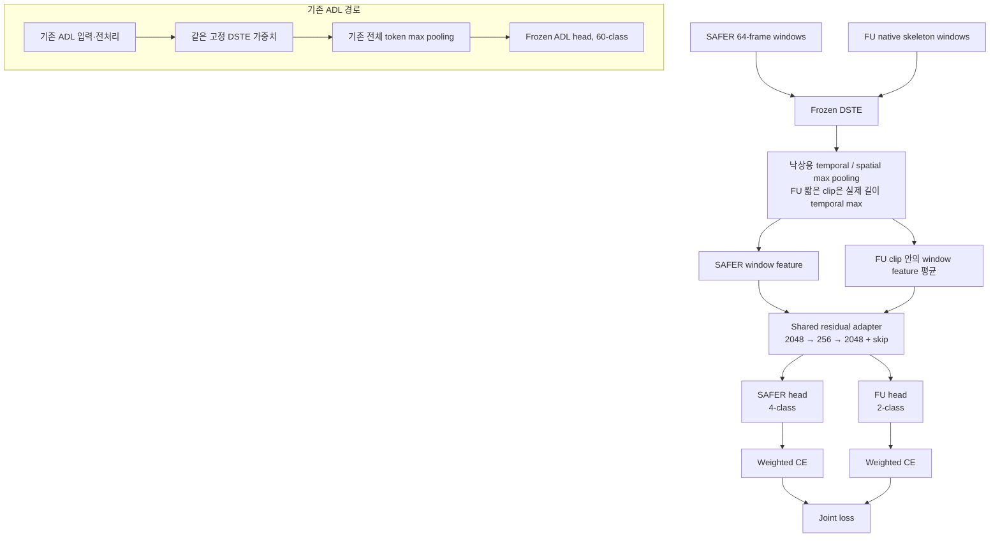
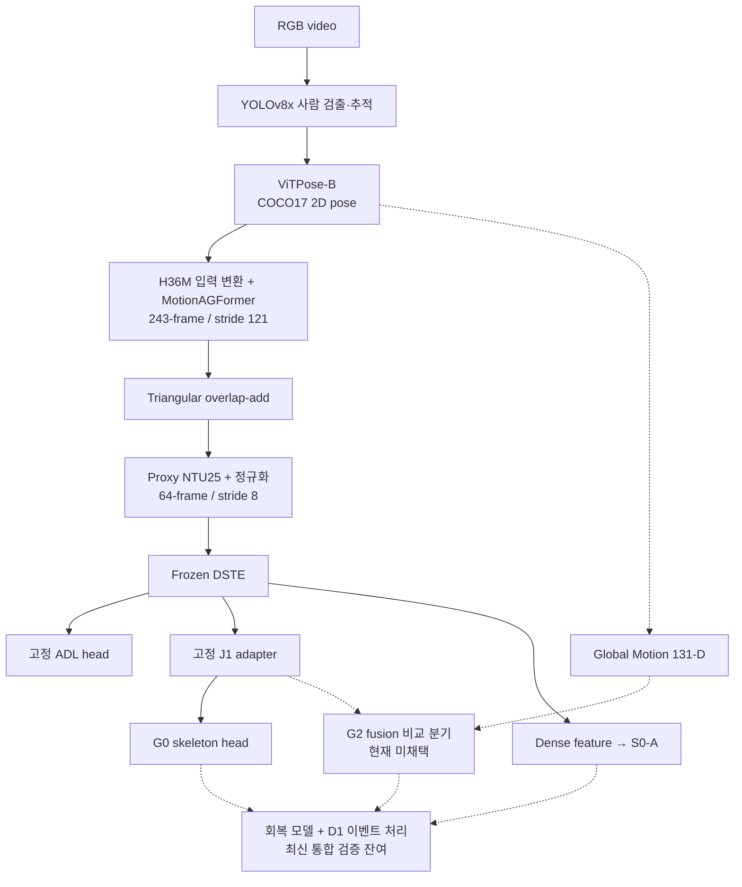

# 고정 DSTE 특징을 이용한 스켈레톤 낙상 분류: 수행 실험 상세 문서

- 문서 ID: `DOC-20260929-paper-methodology-R5`
- 실험 기록 기준일: 2026-09-29
- 문서 수정일: 2026-09-30
- 문서 상태: 방법론 초안 정리 완료
- 연구 상태: `in_progress` — 핵심 공동학습 평가 완료, 상태 후속·회복·전체 외부 이벤트 평가 잔여
- 방법 기준: 현재 V3 R3 입력과 J0/J1 공동학습 설정
- 목적: 실제 수행한 입력·모델·연산·학습·평가를 Methods와 실험 기록으로 정리

이 문서는 실제 구현과 확인된 실험을 논문 형식으로 기술한다. 수식은 코드의 연산과 실행 순서를
표현하며, 사용한 기존 모델의 구조는 해당 출처를 인용한다.
모든 과거 실험에 같은 설정을 소급 적용하지 않으며 과거 결과와 현재 실험의 수치 동등성을
가정하지 않는다. 아래 상태와 수치는 기준일의 확인 범위다.

논문에 사용할 간결한 서술은 [핵심 Methods 본문](2026-09-29_paper_methods_main_shared.md)으로
분리했다. 이 문서는 방법·재현 조건·결과·확장·한계를 함께 보관하는 상세 연구 자료다.
R2에서는 confidence 대응, 라벨 의미, 공간 token 선택, J0/J1의 비교 범위와 nested 초기화를
확인하고 설명을 보완했다. R3에서는 `no_label`의 실제 포함, FU native 전처리, ADL과 낙상
readout의 구분, 학습 update·노출량과 head 적용 범위를 추가했다. R4에서는 수행한 절차를
Methods의 중심으로 정리하고 사후 가설·미실행 실험 제안을 구분했다. R5에서는 정규화 대상의
서술과 본문 연결을 명확히 했다. 대응하는 핵심 Methods는
`DOC-20260929-paper-methods-main-R4`다. 기존 학습 조건과 성능 수치는 변경하지 않았다.
미실행 제안은9.2절의 별도 참고 내용이며, 기록된 실험을 Methods로 작성하는 선행 조건이 아니다.

## 목차

- [1. 기록 대상과 논문의 범위](#scope)
- [2. 전체 파이프라인과 모듈의 역할](#pipeline)
- [3. 기호와 입력·출력 단위](#notation)
- [4. 방법의 상세 기술](#methods)
- [5. 전역 움직임과 상태·이벤트 확장](#extensions)
- [6. 실험 설정과 평가 프로토콜](#evaluation)
- [7. 현재 확인된 결과와 해석](#results)
- [8. 수식·구현의 출처와 연산 범위](#provenance)
- [9. 결과 해석 범위와 별도 후속 제안](#limits)
- [10. 논문 구성과 서술 예시](#manuscript)
- [11. 참고문헌과 연결 문서](#references)
- [12. 재현 세부사항과 검토 반영](#reproducibility)

## 1. 기록 대상과 논문의 범위

### 1.1 수행 실험의 범위

본 연구에서는 DSTE와 기존 일상행동 분류기를 고정하고, 미리 추출한 특징으로 SAFER/FU의
낙상 분류 모듈을 학습하였다. SAFER는 중앙 프레임 라벨의 window 분류, FU는 window 특징을
평균한 clip 분류로 구성하였다. J0에서는 두 선형 head를 학습하고, J1에서는 선택된 J0 head를
복사한 후 공유 residual adapter와 두 head를 학습하였다.

원고에서는 수행 기록을 다음과 같이 배치한다.

| 수행 내용 | 원고에서의 처리 |
| --- | --- |
| 고정 DSTE 특징·데이터셋별 집계·J0/J1 학습과 평가 | 핵심 Methods와 실험 결과 |
| Global Motion G0/G1/G2 학습·비교 | 별도 추가 특징 실험; 미채택 G2를 최종 구성에 포함하지 않음 |
| S0-A 상태 분류 학습·평가 | 원 DSTE dense 특징을 사용한 별도 상태 분류 실험 |
| 외부 RGB 연결 검사 | 처리 연결·출력 검산 범위의 기술 검사 |
| 회복 타깃·decoder 등 확장 | 구현·타깃 구성·평가의 실제 완료 범위를 구별 |

위 절차는 실제 사용한 모델과 실행 순서를 기술한다. 공유의 상보성이나 우수성을 실험 당시의
설계 동기로 사후에 추가하지 않는다. 수행하지 않은 비교는 완료 실험 및 핵심 Methods와 분리한다.

### 1.2 핵심 방법과 확장 범위

| 범위 | 구성 | 논문에서의 역할 |
| --- | --- | --- |
| 핵심 방법 | Frozen DSTE, 고정 ADL head, 공유 residual adapter, 데이터셋별 head | 본문 Methods의 중심 |
| 입력 구성 | RGB lifting, H36M17→proxy NTU25, V3 overlap-add, 정규화 | 재현 가능한 입력 정의 |
| 추가 특징 | Global Motion 131-D, G0/G1/G2 | 수행한 특징·분류기 비교 |
| 상태 확장 | S0-A dense 16-class 상태 분류 | 별도 감독 단위의 확장 실험 |
| 사건 확장 | 회복 타깃, S0-G0 구조, D1 decoder | 구현과 검증 수준을 구분한 후속 범위 |
| 향후 계층 | VLM, audio, TrackMemory | 통합 성능을 주장하지 않는 후속 연구 |

논문의 중심 설명은 다음과 같다.

> 본 연구에서는 고정된 스켈레톤 특징 위에 공유 residual adapter와 데이터셋별 분류기를 학습하였다.
> SAFER의 window 정답과 FU-Kinect의 clip 정답을 각각 사용하였으며, 기존 ADL 분류 경로는
> 원래의 전처리·pooling·분류기를 유지하였다.

## 2. 전체 파이프라인과 모듈의 역할

### 2.1 학습 구조

**그림 1 설명.** DSTE와 ADL head는 고정한다. SAFER와 FU는 공유 adapter를 사용하지만,
특징의 시간적 집계와 출력 공간은 다르다. ADL 손실은 현재 낙상 공동학습의 목적함수에 포함되지
않는다. 그림의 DSTE는 특징 생성의 의존성을 나타내며, 실제 공동학습은 고정된 특징을 사용해
수행할 수 있다. RGB부터 모든 모듈을 한 번에 역전파하는 학습 구조는 아니다.
ADL의 기존 전처리·pooling은 별도로 유지한다. 그림에서 같은 가중치의 DSTE를 경로별로
표기한 것이며 FU의 짧은 clip 처리 규칙을 ADL readout에 적용하지 않는다.

### 2.2 RGB 추론과 확장 경로

**그림 2 설명.** 실선은 해당 특징·분류 경로를, 점선은 비교 분기 또는 후속 통합을 나타낸다.
G0와 G2는 고정 J1 특징 위에 별도로 학습한 head이며 J1의 SAFER head와 같은 파라미터가 아니다.
현재 RGB 기술 검사는 분류까지 연결한 범위다. 기존 D1 구현은 G2 낙상 결정을 입력으로 사용하며,
G0를 포함한 최신 선택 모델과의 사건 통합은 별도 검증 대상이다. 그림이 전체 경로의 배포·성능
검증 완료를 의미하지 않는다.

### 2.3 세 가지 구분

- **입력 공간:** native skeleton과 RGB-lifted proxy skeleton은 같은 배열 모양이어도 관측 특성이 다르다.
- **학습 단위:** SAFER window, FU clip, S0-A frame을 구분한다.
- **평가 수준:** 기술 연결, 분류 성능, 상태 안정성, 사건 검출 성능을 구분한다.

## 3. 기호와 입력·출력 단위

| 기호 | 의미 | 차원 또는 범위 |
| --- | --- | --- |
| $X$ | 스켈레톤 window | $3\times64\times25\times2$ |
| $f_\theta$ | 고정 DSTE | 시간·공간 token 출력 |
| $H_T,H_S$ | 시간·공간 특징 | $64\times1024$, $50\times1024$ |
| $z$ | Max-pooled window 특징 | 2048 |
| $h_\phi$ | 고정 ADL 분류기 | 60-class |
| $A_\psi$ | 공유 residual 보정 함수 | 2048→256→2048 |
| $z'$ | Adapter 적용 후 특징 | 2048 |
| $g_S,g_F$ | SAFER/FU 분류기 | 4-class / 2-class |
| $K_i$ | FU clip $i$의 window 수 | clip마다 다름 |
| $\bar z_i^F$ | FU clip의 평균 특징 | 2048 |
| $B_d$ | 데이터셋 $d$의 학습 batch | $d\in\{S,F\}$ |
| $n_c^{(d)},w_c^{(d)}$ | 학습 클래스 빈도와 가중치 | 데이터셋·학습 fold별 계산 |
| $g$ | 전역 움직임 descriptor | 131 |
| $d_t$ | S0-A 프레임별 dense 특징 | 2048 |
| $p_t$ | S0-A 상태 확률 | 16 |

수식의 batch 차원은 필요한 경우를 제외하고 생략한다. SAFER 중앙 정답의 offset 32는
0부터 시작하는 인덱스다. D1의 시간 인덱스는 예측 endpoint 순서이며 원영상의 모든 프레임을
뜻하지 않는다.

## 4. 방법의 상세 기술

이 절은 현재 방법의 상세 기술이다. 간결한 논문 본문은 별도 Methods 문서에 두고, 여기에는
재현 조건과 해석상 주의점도 함께 남긴다. 수식 번호 M1–M9는 이 문서 내 참조용이다.

### 4.1 Overall framework

본 연구에서는 사전학습된 스켈레톤 인코더 DSTE와 기존 일상행동 분류기를 고정하고,
추출한 특징 위에 공유 residual adapter와 데이터셋별 낙상 분류기를 학습하였다.
인코더와 일상행동 분류기를 optimizer에서 제외하고 고정 특징을 미리 추출하였다.

SAFER는 낙상과 눕기 관련 상태의 감독 정보를 제공하고 FU-Kinect는 intentional lying을 포함한
fall/non-fall clip을 제공한다. 학습에서는 데이터셋별 특징 집계와 출력층을 사용하고,
공유 adapter에 두 데이터셋 손실의 gradient를 적용하였다.

### 4.2 Skeleton preparation and temporal alignment

FU native skeleton은 Kinect20→proxy NTU25 배치와 프레임 중심화·첫 프레임3D 어깨 회전을
사용하며 몸통 scale 정규화를 적용하지 않는다. 세부 규칙은 [12.7절](#native-fu)에 명시한다.
RGB 기반 입력은 사람 검출과 2D
자세 추정을 거쳐 MotionAGFormer로 3D 자세를 추정한다. SAFER 학습에는 배포된 2D pose를 사용하며,
외부 RGB 추론에는 YOLOv8x와 ViTPose-B를 사용한다. 모델 출처는 [R2–R4]와 같다.
SAFER 배포 pose는 ViTPose-H 기반이므로, 외부 RGB의 ViTPose-B와 자세 추정 조건이 다르다.
이 차이를 RGB domain 전이 조건에 포함한다. 근거: [SAFER 논문 부록 A](https://arxiv.org/html/2609.08038v2).

COCO 형식의 2D 관절 좌표는 H36M 관절 체계에 맞게 배치한 후 영상 크기를 반영하여 정규화한다.
현재 입력은 XY만 재배열하고 confidence는 COCO 인덱스 순서로 연결한다. MotionAGFormer는
이 세 채널을 실제로 사용하므로, 좌표와 confidence의 관절 의미가 불일치하는 입력이다.
가상 중심 관절의 confidence도 합성하지 않고 같은 index의 COCO score를 사용한다.
기존 결과는 이 입력에 조건부인 결과이며, 의미를 맞춘 입력의 결과로 재사용할 수 없다.
[12.1절](#reproducibility)의 대응표와 별도 비교 과제를 함께 참조한다.

긴 sequence의 3D 추정에는 길이 243, 간격 121의 겹치는 구간을 사용한다. 정상 입력과 좌우 반전
입력의 예측을 원래 관절 순서로 되돌려 평균하고, root-relative 출력 규칙을 적용한다. 동일 프레임에
대해 얻은 여러 구간의 예측은 다음과 같이 결합한다.

**식 M1 — V3 가중 겹침 결합**

$$
\hat P_t=
\frac{\sum_{k:t\in W_k}w(t-s_k)\hat P_t^{(k)}}
{\sum_{k:t\in W_k}w(t-s_k)},
\qquad
w(u)=\max\left(0.05,1-\frac{|u-121|}{121}\right).
$$

여기서 $s_k$는 구간의 시작 프레임, $u\in\{0,\ldots,242\}$는 구간 내부 위치다.
중앙 예측에 높은 비중을 부여하고 경계의 최소 가중치를 유지한다. 짧은 sequence는 마지막 pose를
반복해 입력 길이를 맞추고 실제 프레임의 출력만 유지한다. 긴 sequence에서는 규칙적인 시작점의
마지막 window가 끝에 닿지 않으면 시작점 $T-243$의 끝맞춤 window를 반드시 추가한다.
이 lifting 규칙은 뒤의 64프레임 분류 window 규칙과 구분한다.

H36M17의 출력을 결정적인 대응 규칙으로 NTU25에 연결한다. H36M17에 없는 손끝·엄지·발끝
좌표는 가까운 손목·발목 관절로 대체하며 결과를 proxy NTU25로 정의한다. 이는 native Kinect의
관절 측정과 동일한 관측값이 아니다. SAFER와 외부 RGB의 lifting 기반 proxy에는 몸통 길이
중앙값을 0.5로 맞추는 scale 정규화, 매 프레임 SpineMid 중심화, 첫 유효 어깨 방향의 yaw 정렬을
적용하였다. FU native skeleton의 전처리는 이 정규화와 구분하며 [12.7절](#native-fu)에 기술한다.

**식 M2 — RGB/SAFER proxy 정규화**

$$
\tilde P_{t,j}=sR_y\left(P_{t,\pi(j)}-P_{t,\pi(j_{\mathrm{mid}})}\right),
\qquad
s=\frac{r_{\mathrm{torso}}}{\operatorname{median}_{t\in\mathcal V}\ell_{\mathrm{torso}}(t)}.
$$

$\pi$는 H36M과 NTU 관절 대응, $\mathcal V$는 몸통 길이가 유효한 프레임 집합이다.
현재 $r_{\mathrm{torso}}=0.5$이며 실제 미터 단위를 뜻하지 않는다. 몸통 길이는 proxy NTU의
joint20과 joint0 사이의3D 거리이고, $\mathcal V=\{t:\ell_{\mathrm{torso}}(t)>10^{-8}\}$다.
이 집합이 비면 $s=1$이다. Shoulder 방향은 scale을 적용한 좌표의 joint8−joint4이며, XZ norm이 $10^{-8}$보다
큰 첫 프레임에서 $\alpha=\operatorname{atan2}(v_z,v_x)$를 구한다. 회전은 열벡터 기준
$R_y(\alpha)=\left[\begin{smallmatrix}\cos\alpha&0&\sin\alpha\\0&1&0\\-\sin\alpha&0&\cos\alpha\end{smallmatrix}\right]$
이고 유효 어깨가 없으면 단위 회전이다. 이는 중력 방향 교정이 아니다.

변환된 SAFER sequence는 길이 64, 간격 8의 분류 window로 나눈다. 시작점은
$0,8,16,\ldots$ 중 완전한 64프레임을 포함하는 위치만 사용하며 불규칙한 tail window는
추가하지 않는다. SAFER와 현재 RGB 정렬은 25fps, 공동학습 FU 특징은 native30을 사용한다.
따라서 두 데이터의 64프레임은 같은 실제 시간 길이라고 가정하지 않는다.

양방향 lifting과 sequence 통계를 포함하므로 이 전처리 전체를 실시간 인과적 추론으로
주장하지 않는다. 25fps에서 64프레임은 표본 수 기준 2.56초의 관측 길이이며 실제 처리 지연은
별도 측정이 필요하다.
분류 정답은 $s+32$, window의 마지막 관측은 $s+63$이다. 두 시각의 차이는25fps에서
$31/25=1.24$초다. Endpoint에 출력을 붙여도 학습 타깃이 endpoint 정답으로 바뀌지 않는다.
사건 정답 시각·필요 관측 완료 시각·실제 알림 출력 시각을 별도로 정의해야 하며,1.24초를
전체 파이프라인의 측정 지연으로 보고하지 않는다.

### 4.3 Frozen skeleton representation

특징 추출에는 기존 DSTE [R1]를 사용한다. 입력
$X\in\mathbb R^{3\times64\times25\times2}$의 차원은 XYZ, 시간, 관절, 사람 슬롯을 뜻한다.
단일 인물 입력에서는 두 번째 슬롯을 0으로 채운다. 이 형식만으로 다중 인물의 추적·낙상 성능이
검증되었다고 볼 수는 없다.

시간 스트림 입력은 $64\times150$, 공간 스트림 입력은 $50\times192$로 재배열한다.
인코더는 두 스트림에서 시간 변화와 관절 관계를 표현한다. Window 분류에는 기존 downstream
구현의 max pooling과 연결 연산을 유지한다.
현재 설정은 NTU60 cross-subject joint-stream checkpoint와 입력 크기에 따라 token 수를
구성하는 DSTE 구현이다. 공개 저장소의 다른17관절 설정과 동일시하지 않는다.
FU의 짧은 clip에서는 temporal max를 실제 프레임 위치에 한정한다. Padding 값은 인코더에는
입력되며 attention에서 제외되는 것은 아니다. 공간 max에는 S0-A의 비영점 선택을 적용하지 않는다.

**식 M3 — 고정 인코더와 window 표현**

$$
(H_T,H_S)=f_\theta(X),
\quad H_T\in\mathbb R^{64\times1024},
\quad H_S\in\mathbb R^{50\times1024},
$$

$$
z=[\operatorname{MaxPool}_{t\in\mathcal T_X}(H_T);\operatorname{MaxPool}_{v}(H_S)]
\in\mathbb R^{2048}.
$$

여기서 $\mathcal T_X$는 일반 window의 전체64위치이며 FU의 짧은 clip에서는 실제 길이 위치다.
평균으로 합친 FU clip 특징은 window 내부 시간 정보를 사용하지만 window 특징 간 순서는
별도로 모델링하지 않는다. 공간 max에는0으로 채운 두 번째 사람 슬롯에 대응하는 출력 token도
포함된다.0 입력이0 token 출력을 보장하지 않으며 padding의 인코더 내부 영향도 남을 수 있다.

기존 ADL은 $F_{\mathrm{ADL}}(x)=h_\phi(P_{\mathrm{ADL}}(f_\theta(T_{\mathrm{ADL}}(x))))$를
유지한다. $P_{\mathrm{ADL}}$은 temporal64/spatial50 전체 max이다. 낙상용 FU 짧은 clip
readout으로 이 경로를 교체하지 않는다. 낙상 학습은 $\theta,\phi$를 변경하지 않으며,
인코더와 ADL head를 optimizer에서 제외한다. 고정된 특징을 사용하는 공동학습에서는 이 두 모델의
순전파 없이 추가 모듈만 최적화할 수 있다. 고정 상태와 초기 출력의 동일성은 별도의 검산 대상으로
다룬다. 보존 범위는 동일한 입력·전처리·추론 조건의 기존 경로이며 새로운 RGB domain에서의
ADL 정확도까지 같다는 의미는 아니다.

### 4.4 Shared residual fall adaptation

학습에서는 데이터셋별 집계와 출력층을 유지하고 동일한 residual bottleneck adapter를
두 데이터셋의 집계된 특징에 적용하였다.
Layer normalization 뒤에 2048→256 down-projection, GELU, dropout, 256→2048 up-projection을
적용한다. Dropout 확률은 0.1이다.

**식 M4 — 낙상 특징 보정**

$$
h=\operatorname{GELU}\left(W_{\mathrm{down}}\operatorname{LN}(z)+b_{\mathrm{down}}\right),
$$

$$
A_\psi(z)=W_{\mathrm{up}}\operatorname{Dropout}(h)+b_{\mathrm{up}},
\qquad z'=z+A_\psi(z).
$$

Up-projection의 weight와 bias를 0으로 초기화하므로 초기에는 $A_\psi(z)=0$이다.
기준 모델의 head를 복사하면 초기 낙상 예측도 기준 모델과 동일하다. Adapter의 현재 파라미터 수는
layer normalization과 bias를 포함하여 1,054,976개다.
SAFER head8,196개와 FU head4,098개를 포함한 J1의 학습 파라미터 합계는1,067,270개다.
J0는 두 head의12,294개다. 고정 인코더와 ADL 파라미터는 이 학습 수에서 제외한다.
이 zero initialization은 J0의 낙상 예측을 계승하기 위한 조건이다. 기존 ADL 출력의 유지 조건은
별도로 $z$와 $h_\phi$의 경로를 고정하는 것이며, adapter 이후의 $z'$는 학습 중 변한다.

공유 adapter의 출력을 데이터셋별 선형 head에 전달한다.

**식 M5 — 데이터셋별 출력층**

$$
\ell_S=W_Sz'+b_S\in\mathbb R^4,
\qquad
\ell_F=W_Fz'+b_F\in\mathbb R^2,
\qquad p_d=\operatorname{softmax}(\ell_d).
$$

평가에서는 데이터셋에 맞는 head를 사용한다. 미지의 입력 domain에 대한 자동 head 선택이나
두 출력의 통합은 현재 평가한 기능이 아니다. RGB 기술검사는 별도로 학습한 G0/G1/G2를 사용하며
원래 J1 SAFER/FU head와 구별한다.

SAFER는 `other / fall / lie_down / lying_down`, FU는 `non-fall / fall`을 출력한다.
SAFER의 원본 coarse ID10/11/12는 각각 `fall`/`lie_down`/`lying_down`이다.
원 논문 부록은 `lying_down`을 누운 자세로의 전환으로 설명하므로, 이전 초안의
“lie_down=동작, lying_down=정적 상태” 단정은 철회한다. 실제 영상과 annotation 경계의
대조 전까지는 ID와 배포 클래스명을 사용한다. 근거:
[공식 mapping](https://github.com/safer-activities/SAFER-Activities/blob/994ed688ce9e491245ee96c1665e948c6ce6c74d/preprocessing/mappings.json),
[SAFER 부록 E.2](https://arxiv.org/html/2609.08038v2).
어느 클래스의 예측만으로도 낙상 기원을 확정하지 않는다. Adapter 없이 두 head만 학습하는 기준 모델을 J0, adapter와 두 head를 함께
학습하는 모델을 J1으로 정의한다. Residual과 bottleneck 연산은 표준 구성 요소이며 그 자체를
새로운 이론으로 제안하지 않는다.

J0의 두 head는 학습 가능한 공유 파라미터가 없다. 따라서
$\nabla_{\omega_F}\mathcal L_S=\nabla_{\omega_S}\mathcal L_F=0$이며, 같은 loop의 손실 합과
공통 epoch 선택은 표현의 공동학습과 구분한다. J1에서는
$\nabla_\psi\mathcal L=\nabla_\psi\mathcal L_S+\nabla_\psi\mathcal L_F$로 공유 adapter를 갱신한다.
J0/J1 비교에는 비선형성·용량·공유 gradient·추가 head 학습이 동시에 달라지는 요인이 있다.

### 4.5 Preserving dataset-specific supervision units

SAFER에서는 64프레임 window의 zero-based offset 32에 해당하는 원본 상태 정답을 사용한다.
원본 label 10, 11, 12를 각각 fall, lie_down, lying_down으로 대응시키고 나머지 상태는 other로
통합한다. 이 window 분류기를 dense segmentation으로 표현하지 않는다.
`other`에는 원본 ID0–9,13–15가 포함되며 `no_label`인 ID0도 삭제·ignore 없이 포함한다.
전체 split의 원본/파생 center label을 대조했다. 포함 수와 의미의 제한은 [12.8절](#other-label-policy)에 둔다.

FU에서는 하나의 clip에서 얻은 window 특징들을 같은 비중으로 평균하여 clip 특징을 구성한다.
Native30의 길이64/stride8을 사용한다. 짧은 clip은 마지막 프레임을 반복하고, 긴 clip의 마지막
정규 window가 끝에 닿지 않으면 끝맞춤 window를 추가한다. 현재993clip의5186windows에서
$K_i$는1–17, 중앙값5, 평균5.223이다. 길이64 미만130clip의 temporal pooling 범위는 실제 길이다.

**식 M6 — FU clip 특징 집계**

$$
\bar z_i^F=\frac{1}{K_i}\sum_{k=1}^{K_i}z_{i,k}^F,
\qquad
p_i^F=\operatorname{softmax}\left(g_F\left(\bar z_i^F+A_\psi(\bar z_i^F)\right)\right).
$$

Adapter는 평균 특징에 적용한다. 비선형 adapter를 window마다 적용한 후 평균하는 것과는
일반적으로 같지 않다. Falling만 positive로 두고 walking, bending, sitting, squatting,
intentional lying은 negative로 처리한다. Clip label을 프레임별 상태 정답으로 복제하지 않는다.

이 구성에서 공통 배열 모양이나 공유 adapter가 domain gap의 제거를 보장하지는 않는다.
현재 목적함수에는 adversarial domain loss나 별도 feature-alignment loss가 포함되지 않는다.

### 4.6 Joint objective and two-stage optimization

각 데이터셋의 클래스 불균형을 고려하여 학습 집합의 빈도로 가중치를 계산한다.
SAFER 빈도의 단위는 window, FU 빈도의 단위는 해당 학습 fold의 clip이다.

**식 M7 — Train-only 클래스 가중치**

$$
\tilde w_c^{(d)}=\frac{1}{\sqrt{\max(n_c^{(d)},1)}},
\qquad
w_c^{(d)}=\frac{\tilde w_c^{(d)}}{C_d^{-1}\sum_{j=0}^{C_d-1}\tilde w_j^{(d)}}.
$$

검증·평가 집합의 클래스 빈도는 가중치 학습에 사용하지 않는다. 현재 구현의 weighted mean
cross-entropy와 공동 목적함수는 다음과 같다.

**식 M8 — 공동학습 손실**

$$
\mathcal L_d=-\frac{\sum_{i\in B_d}w_{y_i}^{(d)}\log p_{i,y_i}^{(d)}}
{\sum_{i\in B_d}w_{y_i}^{(d)}},
\qquad
\mathcal L_{\mathrm{joint}}=\mathcal L_S+\mathcal L_F.
$$

한 step에서 두 데이터셋의 batch를 하나씩 사용한다. SAFER를 한 번 순회하는 것을 한 epoch로
정의하고 FU 학습 집합은 독립적으로 섞어 반복 순회한다. 두 손실의 계수는 모두 1이며, 두
데이터셋의 표본 수나 gradient 크기가 같다는 뜻은 아니다.
SAFER의 마지막 작은 batch를 유지하고 FU는 permutation 경계를 넘어32개를 채운다.
현재 epoch당75updates, FU2,400개 노출이며 마지막 SAFER batch는2,975개다.
가중치의 mean-one 정규화는 각 데이터셋의 weighted-mean CE 분자와 분모에서 상쇄된다.
따라서 이 정규화를 데이터셋 사이의 loss scale 또는 gradient 크기를 맞추는 방법으로 해석하지 않는다.

학습은 J0 head 학습과 J1 보정 학습의 두 단계로 수행한다. J0의 선택된 head를 J1에 복사하고
zero-initialized adapter를 추가한다. J1에서는 adapter와 두 head를 함께 학습한다. J1 epoch 0도
선택 후보에 포함하여 추가 학습이 검증 지표를 개선하지 못하면 초기 상태를 선택할 수 있게 한다.
Epoch 0의 출력 동일성은 지정된 전체 검증 입력으로 검사한다.
J1은 새로운 AdamW로 시작하며 J0 optimizer의 moment를 복사하지 않는다. 같은 phase의
중단 후 재개는 optimizer·RNG를 복원하는 별도 절차다. 상세 반복 규칙은 [12.9절](#training-budget)에 둔다.

| 설정 | J0 | J1 |
| --- | ---: | ---: |
| Optimizer | AdamW | AdamW |
| Head 초기 learning rate | 0.001 | 0.00005 |
| Adapter 초기 learning rate | 해당 없음 | 0.0001 |
| Weight decay | 0.0001 | 0.0001 |
| Betas / epsilon | (0.9, 0.999) / 1e-8 | (0.9, 0.999) / 1e-8 |
| 개발·선택 최대 epoch | 30 | 20 |
| SAFER / FU batch | 8192 / 32 | 8192 / 32 |
| LR 감소 시점 | 20, 25 epoch 완료 후 | 12, 16 epoch 완료 후 |
| LR 감소 배율 | 0.1 | 0.1 |
| Seed | 0 | 0 |

Learning-rate schedule은 완료 epoch 기준이다. 예를 들어 J0의 첫 감소는 epoch 21부터 적용된다.
공동학습에서는 DSTE 특징의 별도 표준화를 적용하지 않는다. 최종 후속 모델의 학습 횟수는 최대
epoch 수와 구분하며 nested inner 선택 횟수의 중앙값으로 정한다.

개발·inner 선택에서는 두 데이터셋의 지표를 다음과 같이 결합한다.

**식 M9 — 모델 선택 점수**

$$
S=\frac{\operatorname{MacroF1}_{\mathrm{SAFER,val}}+
\operatorname{F1}_{\mathrm{FU,val}}}{2}.
$$

두 지표는 0–1 scale에서 계산한다. 동률이면 FU AP, SAFER fall-vs-lie AP, 더 이른 epoch 순으로
선택한다. 이 점수는 gradient를 계산하는 학습 손실이 아니다. 평가 split과 ensemble의 구성은
[실험 프로토콜](#evaluation)에서 별도로 정의한다.

## 5. 전역 움직임과 상태·이벤트 확장

이 절의 모듈을 모두 J1 앞뒤에 직렬로 배치한 하나의 학습 모델로 해석하지 않는다. 별도 분기와
대조 실험이 포함돼 있으며, 모듈별 학습·평가 단위가 다르다.

### 5.1 Global Motion 131-D

신체 중심 정규화는 자세 비교에 유리하지만 영상 내 위치 이동과 크기 변화의 일부를 제거한다.
이를 보완할 수 있는지 확인하기 위해 2D 관절과 bounding box에서 영상 상대 움직임을 추출한다.
현재 12개 채널은 다음과 같다.

| 채널 | 차원 | 정의 |
| --- | ---: | --- |
| 골반 중심 | 2 | 양쪽 엉덩이 좌표 평균, 영상 폭·높이로 정규화 |
| Box 중심 | 2 | Bounding box 중심 x·y, 영상 크기로 정규화 |
| Box 크기 | 2 | 폭·높이를 영상 크기로 정규화 |
| 어깨 중심 | 2 | 양쪽 어깨 좌표 평균, 영상 크기로 정규화 |
| 몸통 벡터 | 2 | 정규화된 어깨 중심−골반 중심 |
| 몸통 길이 | 1 | 정규화된 몸통 벡터의 크기 |
| Pose confidence | 1 | 유한하고 음수가 아닌 관절 confidence의 평균 |

관절 유효성에는 좌표의 유한성, 영점 여부와 confidence 0.2 기준을 사용한다. Box에는 유한성과
양의 크기를 요구한다. 결측은 0과 명시적인 mask로 표현하며 보간하지 않는다.

전체 sequence에서 과거 3프레임의 유효 관측만으로 평균을 계산하고 후방 차분을 적용한다.
Window별로 미분을 다시 시작하지 않는다. 유효 피연산자가 없는 차분은 invalid로 표시한다.

**식 E1 — 영상 상대 속도·가속도**

$$
v_t=f_{\mathrm{fps}}(\bar q_t-\bar q_{t-1}),
\qquad
a_t=f_{\mathrm{fps}}(v_{t,y_{\mathrm{pelvis}}}-v_{t-1,y_{\mathrm{pelvis}}}),
\quad f_{\mathrm{fps}}=25.
$$

여기서 y는 영상 수직축이다. 카메라 운동, 원근과 2D 추정 오차의 영향을 받을 수 있으며 실제
중력 방향 가속도와 동일한 물리량이 아니다.

64프레임 구간에서 채널별 level·velocity의 평균, 모집단 표준편차, 최솟값, 최댓값,
마지막 endpoint 값을 계산한다. 마지막 값은 endpoint가 유효할 때 그 값, 그렇지 않으면0이며
과거의 마지막 유효값을 찾아 대입하지 않는다. 골반 y 가속도에는 평균·모집단 표준편차·최솟값·최댓값의
네 통계만 사용하고 일곱 품질 정보를 결합한다.

$$
\dim(g)=12\times5+12\times5+4+7=131.
$$

통계는 유효 관측만 사용한다. 일곱 품질 정보는 전체 mask 비율, 모든 채널이 유효한 프레임 비율,
endpoint의 유효 채널 비율, 채널별 coverage의 최솟값·평균·최댓값, window 길이다.
전역 특징은 train 평균과 표준편차로만 표준화한다. J1 특징에는 이 표준화를 적용하지 않는다.

**식 E2 — 동일 조건의 특징 비교**

$$
\ell_{G0}=W_0z'+b_0,
\quad
\ell_{G1}=W_1\tilde g+b_1,
\quad
\ell_{G2}=W_2[z';\tilde g]+b_2.
$$

$\tilde g$는 표준화한 전역 특징이다. 세 head의 입력은 2048, 131, 2179차원이며 출력은
동일한 SAFER 4-class다. DSTE·ADL·최종 J1은 고정하고 세 head만 같은 데이터 순서와 조건으로
학습한다. 현재 설정은 SGD, learning rate 0.006, momentum 0.9, weight decay 0, batch 512,
50epoch, seed 0이다. G2는 feature concatenation이며 attention·gate 구조는 사용하지 않는다.

채택 조건은 validation Macro-F1이 G0보다 0.5%p 이상 높고, fall recall과 lie_down F1 저하가
각각 1%p 이내인 것이다. 현재 G2는 첫 조건을 충족하지 못해 `not_selected`다.
관련 근거: [Global 학습 결과](2026-09-28_global_motion_training_shared.md).

### 5.2 S0-A dense 상태 분류

S0-A는 원래의 고정 DSTE에서 dense 특징을 얻는 별도 분기이며 J1 adapter 출력을 사용하지 않는다.
Temporal token을 유지하고, 비영점 입력에 대응하는 spatial token의 평균을 각 프레임에 연결한다.
선택 규칙은 $m_v=\mathbf1[\exists t,c:X_{c,t,v}\ne0]$이다. 정규화 후 SpineMid는 정상 관측에서도
항상0이므로 제외된다. 따라서 이를 관측 유효성 마스크라고 부르지 않는다.
관측 존재·confidence를 정규화 전부터 전달하는 마스크는 별도 비교 대상이다.

**식 E3 — Dense 표현과 상태 분류**

$$
c_S=\frac{\sum_vm_vH_S(v)}{\max(1,\sum_vm_v)},
\qquad d_t=[H_T(t);c_S]\in\mathbb R^{2048},
$$

$$
\ell_t=W_{\mathrm{state}}d_t+b_{\mathrm{state}},
\qquad p_t=\operatorname{softmax}(\ell_t)\in\mathbb R^{16}.
$$

16개 출력은 `no_label`, `stand`, `stand_activity`, `walk`, `sit`, `sit_activity`,
`sitting_down`, `getting_up`, `bend`, `unstable`, `fall`, `lie_down`, `lying_down`,
`reach`, `run`, `jump`다. 현재 학습과 지표는 `no_label`을 포함한다.
`no_label`은 의미가 확인된 정상 행동과 같지 않다. 공식 mapping에는 `mistake`도 이 값으로
합쳐지므로, 미표기·불명확 구간을 정상 background로 단정하지 않는다.
포함 평가와 제외 평가를 분리하는 후속 비교가 필요하며, 현재 지표는 포함 평가다.

동일 프레임을 포함하는 여러 window의 raw logits를 평균한 뒤 확률과 class를 계산한다.

**식 E4 — 겹친 window의 프레임 예측 결합**

$$
\bar\ell_t=\frac{1}{|\mathcal W_t|}\sum_{k\in\mathcal W_t}\ell_t^{(k)},
\qquad \hat y_t=\arg\max_c\operatorname{softmax}(\bar\ell_t)_c.
$$

확률을 먼저 평균하는 방식과 구분한다. Covered frame은 원래 시간축에서 한 번만 평가하며,
미커버 프레임 수를 별도로 기록한다. Dense feature가 시간 token을 유지한다는 이유만으로
미래 관측을 사용하지 않는 모델이 되지는 않는다.

현재 S0-A는 plain CE와 inverse-square-root weighted CE를 각각 12epoch 비교했다.
SGD learning rate 0.006, momentum 0.9, batch 128, seed 0을 사용하며 class weight의 빈도는
고유한 covered train frame에서 계산한다. Validation Macro-F1→Segment F1@50→Edit 순으로
선택하고, 선택 후 test/OOD를 평가했다. 현재 결과에는 smoothing이 없다.

### 5.3 회복을 위한 상태 동역학과 endpoint 모델

상태 확률뿐 아니라 직전 예측과의 변화도 활용하도록 다음 descriptor가 구현돼 있다.

**식 E5 — Posterior dynamics**

$$
r_t=[p_t;\ p_t-p_{t-1};\ H(p_t);\ \max_c p_{t,c};\ p_{t,(1)}-p_{t,(2)}]
\in\mathbb R^{35},
$$

$$
H(p_t)=-\sum_c p_{t,c}\log p_{t,c}.
$$

최초 시점에 이전 확률이 없으면 변화량은 0으로 둔다. 16개 확률, 16개 변화량, entropy,
최대 확률, 상위 두 확률의 차이를 연결하므로 35차원이다. 이를 DSTE의 2048차원 endpoint
특징과 연결한 2083차원 입력에서 background/falling/post_fall/recovering을 예측하는 구조가
S0-G0에 정의돼 있다.
여기서 이전 시점은 helper에 전달한 직전 예측이다. Frame별 출력이면1/25초,
stride8 endpoint 출력이면8/25초 간격이므로, 최종 통합에서 어떤 시계를 사용하는지 명시해야 한다.
현재 변화량은 확률 차이이며 시간 간격으로 나눈 미분은 아니다.

최신 회복 타깃 구성은 낙상 이후 다음 낙상 전의 첫 일어나기를 recovery로 정의한다.
그 이전 구간은 post_fall로 두고, 회복을 관측하지 못한 구간은 ignore로 처리한다.
낙상 이력이 없는 일어나기는 background hard negative로 남긴다. Ignore는 별도의 출력
클래스가 아니라 학습·평가에서 구분해야 하는 타깃 상태다.
여기서 recovery는 첫 `getting_up` 구간이라는 운영상 타깃이며 완전한 회복을 뜻하지 않는다.
원 클래스는 앉았다 일어나기 등도 포함한다. 회복이 보이지 않은 구간에는 관측 종료에 따른
불확실성과 실제로 지속된 post-fall이 함께 있을 수 있으며 현재 ignore 처리로 이를 구별하지 못한다.
회복 미관측 제외 규칙은 긴 post-fall의 학습 분포에도 영향을 줄 수 있다.

타깃 생성에 사용하는 미래의 정답 문맥을 추론 입력으로 사용하지 않는다. 타깃 생성·검산의
완료는 회복 모델의 학습 또는 성능 검증 완료와 다르다. 근거:
[회복 타깃 연구](2026-09-29_s0gt0_reconstruction_shared.md).

### 5.4 D1 event decoder

기존 D1 구현은 낙상 알림과 회복 episode의 상태를 분리한다. Endpoint $e$의 낙상 결정이
$b_e$일 때, 새 알림을 다음과 같이 정의한다.

**식 E6 — 낙상 결정의 상승 경계**

$$
a_e=b_e\land\neg b_{e-1}.
$$

이전 episode가 열려 있더라도 낙상 결정이 다시 상승하면 알림을 발생시킬 수 있다.
회복 상태는 별도 latch에서 추적하며, 표시 상태는 NORMAL/FALLING/POST_FALL/RECOVERING/RECOVERED다.
기존 설정은 회복 관측 후 연속 background endpoint 3개로 정상 종료하고, 25초 timeout으로도
episode를 닫는다. Timeout 종료를 회복 완료로 간주하지 않는다. 회복 완료 표시는 2초 유지한다.

이 규칙은 기존 구현의 설명이며 최신 학습 모델과의 전체 외부 검증은 별도 단계다.
Decoder의 endpoint 갱신이 인과적이라는 사실만으로 upstream lifting·DSTE·시간축 출력까지
전체 온라인 동작이 검증되는 것은 아니다.
낙상 결정이 짧게0/1을 반복하면 한 실제 사건에서 여러 알림이 발생할 수 있다. 이후 사건 평가에는
예측–정답 매칭, 중복 알림 정의, refractory/merge 규칙을 사전에 정하고 비교해야 한다.

### 5.5 기준일의 상태 확장 진행

| 항목 | 상태 | 의미 |
| --- | --- | --- |
| S0-A | `completed` | 두 후보 전체 학습, 선택, 고정 평가 완료 |
| S0-B | `in_progress` | 후속 상태 모델 학습, 정식 결과 미확정 |
| S0-C | `planned` | 상태 안정화 비교, S0-B 결과 대기 |
| S0-GT0 | `completed` | Train/validation 회복 문맥 타깃 구성·검산 완료 |
| 최신 회복 endpoint·외부 이벤트 평가 | 후속 검증 필요 | 전체 시스템 성능으로 보고할 수 없음 |

이 상태는 기준일 snapshot이다. 이후 진행은 [전체 진행 문서](2026-09-22_recovery_execution_shared.md)를
참조한다. S0-C의 과거 채택 결과를 최신 실행의 결과로 재사용하지 않는다.

## 6. 실험 설정과 평가 프로토콜

### 6.1 데이터 역할과 분할

| 데이터 | 역할 | 주요 평가 단위 |
| --- | --- | --- |
| NTU RGB+D 60 | ADL 기준선과 보존 | Sequence Top-1/Top-5, 고정 경로 확인 |
| SAFER Activities | 낙상·눕기 분류, dense 상태 학습 | Window 또는 고유 frame |
| FU-Kinect-Fall [R9] | Fall/intentional-lying 구분 | Subject-disjoint clip |
| OOPS·CAUCAFall·Le2i | RGB·외부 환경 진단 | 품질 coverage, clip 또는 event |

현재 SAFER V3는 **non-wheelchair normal467개와 OOD30개**, 총497개 sequence,
8,091,357프레임이다. Wheelchair subset 전체를 포함한 결과가 아니다. 분할은 다음과 같다.

| Split | Sequences | Windows |
| --- | ---: | ---: |
| Train | 298 | 609,183 |
| Validation | 73 | 106,680 |
| Test | 96 | 219,896 |
| OOD | 30 | 71,964 |
| 합계 | 497 | 1,007,723 |

Train/validation/test는 고정된 사람 단위 분리를 따른다. FU는 품질 기준을 통과한 993clip,
21명을 사용하며 5fold를 구성한다. Fold는 고정된 subject 규칙을 따른다. 겹친 window를
무작위로 나누어 같은 사람·sequence가 학습과 평가에 걸치도록 구성하지 않는다.

공식 데이터의 감독 단위와 프로젝트의 파생 라벨을 구분한다. SAFER의 현재 16-state 또는
4-class 문제를 원 데이터셋 전체 class 체계와 동일한 benchmark라고 표현하지 않는다.

### 6.2 Development, locked evaluation, nested evaluation

1. **Development:** FU의 fold $k$를 선택용으로 두고 나머지 4fold로 학습한다. SAFER의 고정
   train/validation을 함께 사용한다. 이때 얻은 validation OOF는 개발 결과다.
2. **Locked SAFER:** 개발의 다섯 J0/J1 모델을 모두 선택·고정한 후 SAFER test/OOD를 평가한다.
   다섯 모델의 raw logits를 평균하고 softmax/argmax를 적용한다.
3. **Nested FU:** Outer fold $k$는 평가 전용, inner fold $(k+1)\bmod5$는 선택용,
   나머지 3fold는 학습용으로 사용한다. 모델 선택 후 inner를 포함한 재학습은 하지 않고 outer를 평가한다.
4. **Final fit:** Nested의 inner-best epoch 다섯 개의 정수 중앙값으로 학습 횟수를 고정한다.
   SAFER train과 FU 전체993clip을 사용해 후속 파이프라인용 단일 모델을 학습한다.

Outer OOF에서는 모든 FU clip이 정확히 한 번 포함되는지 확인한다. Final fit에서 사용한 FU
전체에 대한 재평가는 학습 진단이며 일반화 성능이 아니다.
각 nested fold에서 J0부터 위 학습/inner 조건으로 독립 학습하고, 그 fold에서 선택한 J0 head를
J1에 복사한다. 다섯 fold의 저장 head tensor·epoch0의 zero-up·저장 validation logits의
동일성을 확인했다. Development 모델이나 FU 전체로 학습한 final 모델을 nested 초기값으로 쓰지 않는다.

현재 nested protocol은 기존 연구 설계·진단 이력 이후의 통제 평가다. 이번 선택 과정에서
outer 사용을 분리했다는 사실을 연구 전 과정의 완전한 미노출 외부평가와 동일시하지 않는다.

### 6.3 Metric과 단위

| Metric | 목적 | 해석 시 주의 |
| --- | --- | --- |
| Macro-F1 | 클래스별 균형 성능 | 클래스 수와 포함 범위를 명시 |
| Fall precision/recall/F1 | 낙상 검출 절충 | Recall 저하를 F1 상승과 함께 보고 |
| AP/AUPRC | 낙상 score의 순위 성능 | 현재 구현은 average precision 계산이며 hard decision과 구분 |
| Intentional-lying FPR | 눕기를 낙상으로 오인하는 비율 | 분모는 lying clip 수 |
| Segment F1@50 | 행동 구간의 label·시간 overlap | Frame F1과 다른 문제 |
| Edit | 상태 sequence의 순서·분절 안정성 | Collapse한 segment label sequence 기준 |
| Event precision/recall/F1 | 사건 단위 감지 | GT 의미·matching tolerance·중복 처리 선행 필요 |

$$
\operatorname{FPR}_{\mathrm{lying}}=
\frac{\#\{\text{lying clip 중 fall로 예측}\}}
{\#\{\text{lying clip}\}}.
$$

FU 이진 결정과 SAFER 분류는 argmax를 사용한다. Outer/test/OOD의 결과로 threshold를
사후 조정하지 않는다. 같은 recall에서의 오탐 비교는 아직 별도 검증할 항목이며, 수행할 경우
운영점 선택은 validation에서 고정해야 한다.

Window 수를 독립 사건 수로 간주하지 않는다. 다중시점 sequence의 사건 수 또한 독립적인
물리적 낙상 사건 수와 다를 수 있다. 불확실성 평가에서는 사람·sequence의 상관을 고려해야 한다.

### 6.4 입력 geometry와 분류 평가의 분리

V3 R3는 이전 퇴화 입력 검사 결과를 확인한 후, 원본 2D 근거가 유효한 구간에서 geometry를
평가하도록 정의를 보완한 post-hoc 실험이다. 학습 프레임을 결과에 맞춰 삭제한 것이 아니라,
정의 가능한 2D 근거의 평가 coverage를 분리한 것이다. 전체 시간축의 3D 유한성·bone·speed·root
검사는 유지한다. 근거가 없는 구간의 의미적 3D 정확도를 주장하지 않는다.

Geometry 경계 이상 감소는 낙상 성능 증가와 별도 결과다. 전처리의 분류 효과는 동일 학습·선택
조건의 대조 모델로 평가해야 한다. 근거: [V3 유효 근거 검산](2026-09-22_v3_valid_support_shared.md).

## 7. 현재 확인된 결과와 해석

이 절의 수치는 Methods에 넣을 설정값과 구분한 결과 자료다. J1·Global·S0-A는 각각의 고정
평가 산출물을 확인한 현재 실험 수치다. 서로 다른 모델·단위의 수치를 하나의 순위로 합치지 않는다.

### 7.1 J0/J1 V3 R3

| 평가 | Metric | J0 | J1 |
| --- | --- | ---: | ---: |
| FU nested | F1 | 92.771% | 93.333% |
| FU nested | Fall recall | 93.333% | 93.333% |
| FU nested | Lying FPR | 7.738% | 6.548% |
| SAFER test ensemble | Macro-F1 | 73.764% | 77.680% |
| SAFER test ensemble | Fall F1 | 75.359% | 79.709% |
| SAFER test ensemble | Fall recall | 88.945% | 85.930% |
| SAFER OOD ensemble | Macro-F1 | 54.876% | 56.606% |
| SAFER OOD ensemble | Fall F1 | 46.841% | 52.915% |
| SAFER OOD ensemble | Fall recall | 79.321% | 74.691% |

FU는 J0/J1 모두 TP154, FN11이며 FP는13→11이다. Lying168clip 중의 오탐이13→11로 줄었다.
그러나 두 모델이 맞힌 낙상 집합은 다르다. 저장 OOF 예측을 쌍으로 비교하면 낙상165개 중
둘 다 정답153, 둘 다 누락10, J0만 정답1, J1만 정답1이다. Lying168개에서는 공통 오탐10,
J0의 오탐 해소3, J1의 새 오탐1, 둘 다 정상154다. 따라서 “낙상 검출을 그대로 유지하며
오탐만 줄였다”는 결론은 성립하지 않는다. 이 비교는 기존 저장 예측의 사후 분석이다.
SAFER에서는 F1이 증가하면서 recall이 감소했다. 따라서 모든 안전 지표의 동시 향상을 주장하지
않는다. 최종 단일 모델은 nested 선택에 따라 J0 13epoch, J1 8epoch로 학습됐으며, 위 SAFER
표는 그 단일 모델의 성능이 아니다.
최종 단일 J1의 원래 SAFER head에 대한 별도 고정 test/OOD 지표는 이 결과표에 없다.
뒤의 G0는 고정된 J1 특징 위에서 **새로 학습한 head**이므로 그 빈칸을 대신하지 않는다.

같은 FU nested 비교의 RBF-SVM F1은93.617%로 J1보다 높다. 해당 비교는 같은 frozen 표현 위의
분류기 통제이며 외부 논문 시스템의 완전한 재현을 뜻하지 않는다. 단일 seed의 작은 차이를
통계적 우월성으로 해석하지 않는다. 근거: [V3 공동학습](2026-09-22_joint_v3_reconstruction_shared.md),
[FU 분류기 비교](2026-09-22_fu_classifier_reconstruction_shared.md).

### 7.2 Global Motion 비교

| 모델 | Val Macro-F1 | Test fall F1 | OOD fall F1 | OOD fall recall |
| --- | ---: | ---: | ---: | ---: |
| G0 | 75.360% | 79.560% | 53.018% | 75.000% |
| G1 | 68.893% | 70.755% | 31.657% | 54.733% |
| G2 | 75.449% | 79.296% | 53.117% | 70.576% |

G2의 validation Macro-F1 이득은0.089%p로 채택 기준0.5%p에 미달했다. 현재 결론은
`not_selected`이며, 작은 OOD F1 증가를 근거로 전체 모델을 교체하지 않는다.
G0/G2는 최종 단일 J1 특징 위에 학습한 새 head이므로 앞 절의 J1 ensemble과 동일한 비교가 아니다.

### 7.3 S0-A

Plain/sqrt 두 후보를 각각12epoch 학습하고 validation에서 sqrt epoch4를 선택했다.

| Split | Covered frames | Frame Macro-F1 | Segment F1@50 | Edit |
| --- | ---: | ---: | ---: | ---: |
| Validation | 857,528 | 66.417% | 12.981% | 19.202% |
| Test | 1,764,544 | 64.685% | 13.508% | 18.778% |
| OOD | 577,392 | 36.440% | 6.505% | 9.827% |

Smoothing은 적용하지 않았다. Frame과 segment 지표의 차이는 시간적 안정성을 별도로 평가해야
함을 보여준다. OOD의 성능 저하도 남아 있다. 이 결과를 회복 event F1로 해석하지 않는다.
근거: [S0-A 방법·결과](2026-09-29_s0a_reconstruction_shared.md).

### 7.4 RGB 기술 연결과 후속 범위

고정된 OOPS3개 영상775프레임 중2개 영상44windows에서 RGB→pose→3D→J1/G0/G1/G2 연결과
저장값 검산을 완료했다. 나머지1개는 coverage76.821%로 사전 기준80%에 못 미쳐 분류를 중단했다.
통과한 두 영상의 G0/G2 fall-argmax window는 모두0개였다. 이 검사는 낙상 성능 성공을 의미하지
않으며 event 정답과 matching을 구성한 전체 평가도 아니다.

S0-GT0의 train/validation371sequence 타깃 구성은 완료됐다. S0-B는 진행 중이고 S0-C는 후속
비교 대기 상태다. 회복 endpoint와 전체 외부 event 평가의 확정 결과는 이 문서에서 주장하지 않는다.
근거: [RGB 연결 검사](2026-09-28_rgb_integration_shared.md),
[상태 후속 진행](2026-09-29_s0b_acceleration_shared.md).

## 8. 수식·구현의 출처와 연산 범위

### 8.1 수식 출처

| 수식 | 이 문서에서의 성격 | 연산·출처의 구분 |
| --- | --- | --- |
| M1 | 프로젝트 V3 겹침 결합 코드의 수학적 표현 | 구현한 위치별 가중 평균 |
| M2 | 현재 RGB/SAFER 정규화의 요약 | FU 전처리는12.7절에 별도 기술 |
| M3 | 기존 DSTE 및 downstream pooling 재사용 | 원 논문·공식 구현을 인용 |
| M4 | J1 adapter 구현을 수식화 | Residual·bottleneck·zero-init 자체는 표준 구성 |
| M5 | 데이터셋별 선형 head | 출력·감독 단위 분리의 설계 설명 |
| M6 | 현재 FU clip 집계 순서 | Mean 후 adapter라는 실행 순서 명시 |
| M7–M8 | 실제 class weight와 공동 손실 | 표준 weighted CE의 합 |
| M9 | 현재 모델 선택 기준 | Validation 지표의 결합 |
| E1–E2 | 현재 전역 descriptor와 linear fusion | 영상 상대 좌표의 차분과 통계 |
| E3–E4 | 프로젝트 dense feature와 겹침 logits 결합 | DSTE의 pooled 표현과 구분 |
| E5–E6 | 상태 동역학 및 D1의 코드 설명 | 구현된 확장과 평가 완료 범위를 구별 |

위 수식은 실제 사용한 연산을 명확하게 기록하기 위한 것이다. 기존 모델은 해당 논문·구현을
인용하고 프로젝트에서 구성한 집계·출력층·학습 순서는 실행 내용으로 설명한다. 관련 adapter
연구 [R7]는 참고문헌이며 현재 J1을 그 모델의 재현이나 새로운 이론으로 기술하지 않는다.

### 8.2 기존 모델과 프로젝트 확장

| 구분 | 구성 |
| --- | --- |
| 기존 연구 활용 | DSTE/USDRL, YOLOv8, ViTPose, MotionAGFormer |
| 프로젝트 입력 처리 | Proxy mapping의 명시, 현재 정규화·시간축 정합, V3 결합·검증 |
| 프로젝트 학습 구성 | J0/J1, 공유 adapter와 SAFER/FU head, 감독 단위별 특징 집계 |
| 프로젝트 비교 | Global131, G0/G1/G2, FU 분류기 통제 |
| 프로젝트 상태 확장 | Dense state head, posterior dynamics, 회복 문맥·D1 규칙 |
| 검증 미완료 확장 | 최신 전체 회복·외부 event·VLM/audio 통합 |

F0A/F0B/F1, FU ZS/probe, P0/P1, LaDy는 여러 연구 질문에 대한 대조·보완 실험이다.
모든 실험 ID가 하나의 직렬 추론 모델에 들어간 것은 아니다. 원고에서는 핵심 J0/J1 실험과
별도로 수행한 비교·확장의 입력, 학습, 평가 범위를 각각 기술한다.

## 9. 결과 해석 범위와 별도 후속 제안

### 9.1 현재 결과의 해석 범위

| 주장 | 현재 가능한 설명 |
| --- | --- |
| 기존 기능 보존 | 고정 입력·전처리·추론 조건에서 ADL 경로 유지 |
| 낙상 전문화 | J0/J1의 고정 프로토콜 차이 관측, 데이터별 절충 존재 |
| 공동학습 | 공유 adapter의 학습 절차와 J0/J1 비교 결과; 공유만의 인과적 효과는 분리하지 않음 |
| Geometry 개선 | 정의된 경계 연속성 지표 개선, 의미적 3D 오차와 별개 |
| 전역 움직임의 이득 | 현재 G2는 채택 기준 미달 |
| 상태 분류 | S0-A 평가 완료, 시간 안정성과 OOD 한계 |
| 회복 감지 | 타깃 구성과 구조 구현, 최신 전체 성능 검증 잔여 |
| 실시간 시스템 | 양방향 lifting·sequence 정규화로 전체 causal 성능 미검증 |
| Privacy | 스켈레톤 중심 처리의 설계 방향, 익명성 보장이나 배포 완료 아님 |

기존 경로 유지는 전처리·pooling·인코더·ADL head와 추론 조건을 유지한 실행 구성에 대한 설명이다.
J0/J1의 수치는 보고한 입력·학습·선택 조건에서 얻은 성능이며, 파라미터 수는 학습 대상의 규모를
기술한 값이다. 구조의 기록과 결과에 대한 해석을 구분한다.

### 9.2 별도 후속 비교 제안 — 미실행

아래는 수행 실험의 기술과 구분하여 보관하는 후속 연구 제안이다. 핵심 Methods·완료 실험에
포함하지 않으며, 기록된 실험을 원고로 작성하기 위한 선행 조건으로 두지 않는다.

| 비교 | 확인할 질문 | 맞춰야 할 조건 |
| --- | --- | --- |
| J0-continued vs J1 | 추가 head 학습만으로 같은 개선을 얻는가? | 같은 선택 J0 초기값·J1 head LR·추가 epoch/선택 규칙 |
| Single-dataset adapter vs joint adapter | 추가 감독 정보의 효과인가? | 입력·adapter 용량·선택 예산 |
| Shared vs dataset-specific adapters | 표현 공유가 필요한가? | 가능한 범위의 파라미터·학습 예산 통제 |
| 용량을 맞춘 MLP/residual MLP vs J1 | 비선형 용량을 맞춘 비교에서 차이가 남는가? | 같은 특징·split·학습/선택 예산 |
| Frozen adaptation vs backbone fine-tuning | 보존·성능·비용의 절충은 무엇인가? | 동일 데이터와 ADL 재평가 |
| 같은 validation 목표 recall의 lying FPR | 운영점 차이와 구분되는가? | Threshold는 validation에서 고정; test recall은 함께 보고 |
| 여러 seed·사람 단위 paired interval | 차이가 안정적으로 반복되는가? | 표본 상관과 선택 절차 고려 |
| 잠근 외부 평가 | 선택 이후 새 환경에서도 유지되는가? | 결과 확인 전 입력·모델·event 규칙 고정 |
| Confidence 정렬 입력 vs 기존 입력 | 관절 score 대응의 영향은 무엇인가? | 가상 관절 score 규칙·별도 전처리와 학습/선택 조건 |
| no_label 포함 vs 제외 | 해당 label 처리의 영향은 무엇인가? | 타깃·class weight·선택·평가 분모를 함께 명시 |

이미 수행한 FU 분류기 비교와 RBF-SVM 결과는7.1절에 별도로 기록되어 있다.

기존 외부 진단 자료를 다시 사용하면 development 이력을 밝힌다. 새 외부평가를 계획할 때는
pose 품질 거부를 정상 negative로 계산하지 않고, coverage와 실패를 포함한 전체 처리 성능을
함께 정의한다. 장시간 운용 주장에는 시간당 오경보와 사건 지연 등 별도 평가가 필요하다.
Validation 목표 recall을 맞춰도 test recall이 같아지는 것은 아니다. Paired bootstrap은 FU에서
subject, SAFER에서 subject 또는 동기화된 recording 단위의 상관을 보존해야 한다. 여러 seed와
독립된 후속 평가를 통해 작은 순오탐2개의 차이가 안정적인지 확인해야 한다.

## 10. 논문 구성과 서술 예시

### 10.1 본문 배치

| 논문 절 | 이 문서의 대응 내용 |
| --- | --- |
| Introduction | 1절의 연구 대상과 수행 범위 |
| Related work | 8절의 기존 기술·프로젝트 구분과 11절의 원문 |
| Methods 3.1–3.5 | [분리한 핵심 Methods 본문](2026-09-29_paper_methods_main_shared.md) |
| Separate experiments | 5절 중 실제 학습·평가한 Global/S0-A 및 RGB 기술검사 |
| Experimental setup | 6절의 분할·단위·선택·평가 |
| Results / ablation | 7절의 검증값과 실제 완료 비교 |
| Limitations | 9절의 적용 범위와 미완료 검증 |

### 10.2 Methods 도입 문단

> 본 연구에서는 사전학습된 DSTE와 기존 일상행동 분류기를 고정하고, 미리 추출한 특징으로
> 낙상 분류 모듈을 학습하였다. SAFER에서는64프레임 window의 중앙 라벨로 네 클래스 분류를
> 수행하였고, FU에서는 window 특징을 평균한 뒤 clip 정답으로 이진 분류를 수행하였다.
> 먼저 adapter 없이 J0의 두 선형 분류기를 학습하고, 선택된 분류기 파라미터를 J1에 복사하였다.
> J1에는 up-projection을0으로 초기화한 공유 residual adapter를 추가하고, 두 데이터셋의 가중
> cross-entropy를 합하여 adapter와 두 분류기를 학습하였다. 각 단계의 optimizer는 새로 생성하였다.

### 10.3 Results 해석 문단

> V3 입력을 사용하는 고정 평가에서 J1은 J0보다 SAFER test 및 OOD의 fall F1이 높았다.
> FU nested 평가에서는 낙상 정탐 수가 같고 intentional-lying 오탐이 감소하였다. 반면 SAFER의
> fall recall은 낮아져, 오탐 억제와 낙상 누락 사이의 절충이 데이터에 따라 달라짐을 확인하였다.
> 전역 움직임을 결합한 G2는 validation의 사전 채택 기준을 충족하지 못하였다. 이 결과는
> 보고한 입력·학습·선택 조건에서의 모델 비교이며, 공유 adapter만의 인과적 효과나 외부 사건
> 검출 성능을 측정한 결과로 해석하지 않았다.

### 10.4 최종 원고에서 확인할 항목

- 수식 M3의 DSTE·pooling은 원 모델 활용으로 인용한다.
- M4–M8은 현재 구성의 수학적 기술이며 표준 연산의 최초성을 주장하지 않는다.
- SAFER window, FU clip, S0-A frame, decoder event의 용어를 일관되게 구분한다.
- 5fold SAFER ensemble과 최종 단일 J1/G0 결과를 분리한다.
- F1 증가와 recall 감소를 함께 보고한다.
- V3 R3의 사후 평가 정의 보완과 기존 개발 자료의 노출 이력을 명시한다.
- 미실행 ablation·미완료 외부평가를 Results에 포함하지 않는다.
- 원고 형식에 맞춰 인용 번호와 수식 번호를 확정하고 실제 선택한 실험 계보를 고정한다.

## 11. 참고문헌과 연결 문서

### 11.1 원 모델·데이터·평가의 출처

- **[R1]** [Foundation Model for Skeleton-Based Human Action Understanding](https://arxiv.org/abs/2508.12586).
  DSTE/USDRL의 원 연구. [공식 구현](https://github.com/wengwanjiang/FoundSkelModel).
- **[R2]** [ViTPose: Simple Vision Transformer Baselines for Human Pose Estimation](https://arxiv.org/abs/2204.12484).
  [공식 구현](https://github.com/ViTAE-Transformer/ViTPose).
- **[R3]** [MotionAGFormer: Enhancing 3D Human Pose Estimation with a Transformer-GCNFormer Network](https://arxiv.org/abs/2310.16288).
  RGB에서 얻은 2D pose의 3D lifting 모델 출처.
- **[R4]** [Ultralytics YOLO 공식 구현](https://github.com/ultralytics/ultralytics).
  RGB 사람 검출에 사용하는 YOLOv8 구현 출처.
- **[R5]** [SAFER-Activities: A Dataset for Smart Assessment of Fall Events and Routine Activities](https://arxiv.org/abs/2609.08038).
  [공식 데이터·코드](https://github.com/safer-activities/SAFER-Activities).
- **[R6]** [MS-TCN 공식 구현](https://github.com/yabufarha/ms-tcn).
  Segment F1과 Edit 평가 관례의 참고 출처. S0 모델 구조를 가져온 것은 아니다.
- **[R7]** [VMT-Adapter: Parameter-Efficient Transfer Learning for Multi-Task Dense Scene Understanding](https://ojs.aaai.org/index.php/AAAI/article/view/29541).
  일반적인 공유·작업별 adapter 선행 연구. 현재 J1이 이 모델을 그대로 재현한 것은 아니다.
- **[R8]** [NTU RGB+D 공식 데이터셋](https://github.com/shahroudy/NTURGB-D).
  ADL 기준선의 데이터 출처.
- **[R9]** [Skeleton Based Efficient Fall Detection](https://doi.org/10.17341/gazimmfd.369347).
  FU-Kinect-Fall의 원 연구. [저자 공개 데이터](https://github.com/MuzafferAslan23/Fall-Detection-Dataset).

### 11.2 연구 방법·결과 문서

- [연구 전체와 참고문헌](2026-09-03_project_complete_summary_shared.md)
- [NTU60 ADL 기준선·보존](2026-09-03_01_ntu60_adl_shared.md)
- [FU 데이터·연구 역할](2026-09-03_02_fu_kinect_shared.md)
- [J0/J1 공통 방법·평가](2026-09-22_joint_reconstruction_shared.md)
- [V3 R3 J0/J1 결과](2026-09-22_joint_v3_reconstruction_shared.md)
- [V3 유효 근거 평가와 사후 변경](2026-09-22_v3_valid_support_shared.md)
- [Global Motion 학습·미채택 결과](2026-09-28_global_motion_training_shared.md)
- [S0-A 방법과 결과](2026-09-29_s0a_reconstruction_shared.md)
- [상태·회복 연구 맥락](2026-09-03_09_state_recovery_decoder_shared.md)
- [S0-GT0 타깃 구성](2026-09-29_s0gt0_reconstruction_shared.md)
- [RGB 통합 기술 검사](2026-09-28_rgb_integration_shared.md)

관련 문서에는 이전 revision의 진행 문장이 남아 있을 수 있다. 현재 결과의 판단에는 해당 문서의
최신 완료 기록과 동일 실험 계보의 평가 범위를 우선한다.

## 12. 재현 세부사항과 검토 반영

### 12.1 Lifting의 좌표·confidence 대응

아래는 **현재 사용한 입력**이다. Index는 모두0부터 시작한다. $C_j$는 COCO 관절 $j$의 XY,
$c_j$는 그 confidence다. 괄호의 해부학적 좌우는 사람 기준이다. 가상 관절의 confidence를
새로 정의한 권장 매핑과 혼동하지 않는다.

| H36M slot | XY의 의미 | XY 원천 | 실제 붙는 confidence 원천 |
| ---: | --- | --- | --- |
| 0 | Pelvis | $(C_{11}+C_{12})/2$ | $c_0$, nose |
| 1 | Right hip | $C_{12}$ | $c_1$, left eye |
| 2 | Right knee | $C_{14}$ | $c_2$, right eye |
| 3 | Right ankle | $C_{16}$ | $c_3$, left ear |
| 4 | Left hip | $C_{11}$ | $c_4$, right ear |
| 5 | Left knee | $C_{13}$ | $c_5$, left shoulder |
| 6 | Left ankle | $C_{15}$ | $c_6$, right shoulder |
| 7 | Spine midpoint | $(C_{11}+C_{12}+C_5+C_6)/4$ | $c_7$, left elbow |
| 8 | Shoulder midpoint | $(C_5+C_6)/2$ | $c_8$, right elbow |
| 9 | Nose proxy | $C_0$ | $c_9$, left wrist |
| 10 | Head proxy | $(C_1+C_2)/2$ | $c_{10}$, right wrist |
| 11 | Left shoulder | $C_5$ | $c_{11}$, left hip |
| 12 | Left elbow | $C_7$ | $c_{12}$, right hip |
| 13 | Left wrist | $C_9$ | $c_{13}$, left knee |
| 14 | Right shoulder | $C_6$ | $c_{14}$, right knee |
| 15 | Right elbow | $C_8$ | $c_{15}$, left ankle |
| 16 | Right wrist | $C_{10}$ | $c_{16}$, right ankle |

XY의 화면 정규화는 $(2x/W-1,\,2y/W-H/W)$이고 confidence에는 이 정규화를 적용하지 않는다.
비유한 confidence만0으로 바꾼다. 현재 MotionAGFormer-base는 입력 차원3이며 첫 선형 embedding이
confidence 채널도 받는다. 따라서 이 불일치는 문서상의 표현 차이가 아니라 실제 입력 의미의
한계다. 관절별 서로 다른 값을 준 synthetic 입력에서도 XY 재배치와 confidence 원순서 유지를 확인했다.

보고한 J0/J1 결과는 위 입력으로 얻었다. Confidence 불일치의 독립적인 영향은 측정하지 않았고,
의미를 맞춘 입력으로 바꾼 재학습도 이 실험에 포함하지 않았다. 정렬 입력 비교는9.2절의
미실행 후속 제안이며, 위 대응표는 실제 사용한 규칙을 기록한 것이다.

### 12.2 Label ID, 이름, 의미의 검증 수준

| 원본 coarse ID | 배포 이름 | 파생4-class ID | 현재 확인 범위 |
| ---: | --- | ---: | --- |
| 10 | fall | 1 | 원본 이름과 수치 매핑 확인 |
| 11 | lie_down | 2 | 원본 이름·매핑 확인, 동작/상태의 영상 경계 확인 잔여 |
| 12 | lying_down | 3 | 원 논문은 누운 자세로의 전환으로 설명, 영상 경계 확인 잔여 |
| 나머지 | 여러 행동 및 no_label | 0 | other로 통합하는 연구상 정의 |

근거는 [고정 공식 mapping](https://github.com/safer-activities/SAFER-Activities/blob/994ed688ce9e491245ee96c1665e948c6ce6c74d/preprocessing/mappings.json)과
[SAFER 논문 부록 E.2](https://arxiv.org/html/2609.08038v2)다. 원 논문과 이전 한국어 설명의 충돌을
해소했다고 가정하여 두 이름을 자동으로 뒤집지 않는다. 정적/전환 의미는 실제 video의 움직임과
같은 시각의 coarse annotation을 함께 대조한 뒤 확정해야 한다.

기존의 `lying_origin` 파생 규칙은 ID12의 연속 구간 직전에 ID10이면 fall-origin,
ID11이면 intentional-origin, 그 외에는 unknown을 붙인다. 이는 **원본 ID의 인접 관계에 따른
휴리스틱**이다. ID12의 상태 의미가 확정되기 전 이 값을 실제 낙상 후 누워 있는 상태의 기원
정답으로 해석하지 않는다. FU의 intentional-lying clip 라벨은 별도 데이터의 정의이므로
SAFER의 ID11/12 의미와 혼용하지 않는다.

### 12.3 입력과 모델의 재현 조건

| 항목 | 현재 조건 |
| --- | --- |
| 3D lifting | MotionAGFormer-base, H36M 가중치 식별명 `motionagformer-b-h36m.pth.tr`,3채널 입력,243프레임 |
| Flip 복원 관절 순서 | 0,4,5,6,1,2,3,7,8,9,10,14,15,16,11,12,13 |
| Proxy NTU25의 H36M 원천 순서 | 0,7,9,10,11,12,13,13,14,15,16,16,4,5,6,6,1,2,3,3,8,13,13,16,16 |
| DSTE 가중치 계열 | NTU60 cross-subject, joint modality, 가중치 식별명 `ntu60_xs_joint_dste.pth.tar` |
| DSTE 구성 | hidden1024, attention head1, 두 temporal·spatial block, alpha0.5, gap4, kernel1 |
| Token 길이 | 입력 차원에서 계산: temporal64, spatial50 |
| ADL head | 고정60-class linear,2048→60 |
| J0/J1 feature scaling | 별도 표준화 없음 |
| S0-A 입력 | 원 DSTE temporal token + 비영점 spatial context; J1 특징을 사용하지 않음 |

공개 모델명만 같다고 임의의 최신 소스·checkpoint로 교체해도 같은 실험이라고 볼 수 없다.
17관절×2사람 설정의 spatial34와 현재25관절×2사람의 spatial50은 입력 체계가 다르다.
원고의 부속 재현 자료에는 실제 코드 revision·가중치 계열·입력 modality·전처리 revision을
하나의 대응 관계로 제공해야 한다. 이 문서는 현재 실행에서 확인한 크기를 기술한다.
현행 DSTE는 입력 차원에서 token 길이를 계산하는 프로젝트 구현이고, MotionAGFormer는
고정한 base 구현을 사용한다. 모델명과 파일명만으로 byte 수준 동일성을 증명하지 않으므로
재현 시 고정 코드·설정·가중치의 식별 정보도 함께 대조해야 한다.

### 12.4 SAFER subject 분할과 FU window 분포

현재 normal subset의 익명 subject ID는 다음과 같다. 같은 번호가 OOD에 나타나더라도
별도 release의 namespace이므로 숫자만으로 동일 인물 여부를 추론하지 않는다.

| Split | Subject IDs |
| --- | --- |
| Normal train | 1,3,4,5,6,7,8,10,11,14,15,17,19,20,23,26,28,29,31,33,36,37,38,39,41 |
| Normal validation | 2,12,24,25,34,35 |
| Normal test | 9,13,16,18,22,27,32 |
| OOD 별도 release | 1,2,3,4,5 |

이 목록은 현재 sequence manifest와 일치한다. Normal train/validation/test는 subject가
겹치지 않는다. 연구 공개 자료에는 sequence identifier·split·frame/window 수를 담은 manifest도
제공해야 전체 sample 순서와 제외 조건까지 재현할 수 있다.

FU는 fold를 $(\mathrm{subjectID}-1)\bmod5$로 정한다. 전체993clip에서 window 수는5186개다.

| Clip당 window 수 통계 | 값 |
| --- | ---: |
| 최솟값 / 최댓값 | 1 / 17 |
| 25분위 / 중앙값 / 75분위 | 3 / 5 / 7 |
| 평균 | 5.223 |
| 원 길이64 미만 clip | 130 |

Clip 평균은 window마다 같은 가중치를 준다. 겹침과 마지막 끝맞춤 때문에 원본 각 프레임을
균일 가중한 평균과 동일하지 않으며, clip마다 $K_i$도 다르다.

### 12.5 공유 adapter의 함수 형태 — 연산 보충 설명

추론 시 dropout을 제거한 bottleneck 출력을 $u(z)$라 두면 데이터셋 $d$의 logits는
다음과 같이 전개된다.

$$
\ell_d=W_d\{z+W_{\mathrm{up}}u(z)+b_{\mathrm{up}}\}+b_d
=W_dz+(W_dW_{\mathrm{up}})u(z)+(W_db_{\mathrm{up}}+b_d).
$$

따라서 고정된 모델의 순전파는 직접 선형 분기와 비선형 bottleneck 분기를 합친 형태로 쓸 수
있다. 이것은 식 M4–M5에서 도출한 대수적 해석이며 새로운 실험 결과가 아니다.
파라미터 분해·zero initialization·weight decay·여러 head 사이의 공유 제약은 학습에 영향을
주므로, 이 등식으로 임의의 MLP와 학습 과정이 같다고 주장하지 않는다.

실제 수행한 J0/J1과 FU 분류기 비교는7.1절에 기술하였다. 위 식은 사용한 모델의 함수 형태를
설명하며, 미실행 MLP·독립 adapter 비교의 결과를 포함하지 않는다. 후속 비교 제안은9.2절에 분리했다.

### 12.6 확인된 항목과 남은 확인

| 검토 항목 | 이번 확인/수정 | 아직 주장할 수 없는 것 |
| --- | --- | --- |
| Confidence 의미 | 불일치와3채널 사용을 코드·synthetic 입력으로 확인 | 정렬 입력의 성능, 영향 없음 |
| SAFER ID11/12 | 공식 이름 확인, 기존 한국어 단정 철회 | 실제 동작/정적 상태 경계 확정 |
| S0-A 선택 규칙 | 중심 관절 제외 가능성을 확인, 비영점 선택으로 기술 | 관측 마스크와 같은 의미, 수정 효과 |
| J0/J1 학습 경로 | J0 독립 head, J1 공유 gradient를 구별 | 공유 학습만의 인과적 효과 |
| Nested 초기값 | 다섯 fold의 같은-fold J0→J1 head·epoch0 저장 logits 일치 | 연구 이력 전체의 완전한 미노출 |
| FU 정탐 수 동일 | 개별 정답/오류 교체까지 확인 | 동일한 낙상을 모두 계속 검출 |
| Ensemble/단일 모델 |5개 모델 ensemble·final J1·새 G0를 분리 | Ensemble 수치를 단일 모델 성능으로 사용 |
| 시간 의미 | Center label과 endpoint·알림 시각을 구별 | 전체 causal 동작·실측 지연 |
| 회복·이벤트 | Operational target과 중복 알림 가능성을 명시 | 임상적 회복 완료·사건 성능 검증 |

위 표는 수행한 방법과 현재 확인 범위를 구별한다. 원고에는 실제 입력·라벨 매핑·학습 절차를
그대로 기술하고 확인하지 않은 의미나 효과를 추가하지 않는다. 입력 수정이나 추가 비교는
별도의 후속 연구이며 현재 Methods 작성과 분리한다.

### 12.7 FU native skeleton의 관절 배치와 정규화

FU의 입력은 Kinect-v1의20관절 XYZ이며 원본 배열의 각 행은60개 좌표값을 가진다.
현재 처리 순서는 영점 프레임 보정 → proxy25 배치 → 프레임 중심화 → 첫 프레임 어깨 회전이다.
입력 유효 길이의 처리 후 native30fps window를 구성한다.

**영점 프레임.** 모든20관절 XYZ가 정확히0인 프레임을 판별한다. 시작과 끝의 연속 영점
프레임은 제거하고, 내부 영점 프레임은 각 좌표별로 전후 유효 프레임을 선형 보간한다.
한 관절만0인 경우까지 이 규칙으로 보간하는 것은 아니다. 전체가0인 clip은 입력 오류로 처리한다.
이 보정은 float64에서 수행한 뒤 정규화 시 float32로 변환한다.

**관절 배치.** 아래 index는0부터 시작한다.

| Proxy NTU25 index | Kinect20 원천 index | 역할 |
| --- | --- | --- |
| 0–19 | 같은 index0–19 | 기존20관절을 직접 배치 |
| 20 | 2 | 별도 SpineShoulder 측정 대신 ShoulderCenter 복사 |
| 21,22 | 7 | 왼손 끝·엄지 proxy로 기존 왼손 복사 |
| 23,24 | 11 | 오른손 끝·엄지 proxy로 기존 오른손 복사 |

H36M17에서 생성한 RGB proxy와 FU의 Kinect20 기반 proxy는 원천 관절과 보간 규칙이 다르다.
둘 다25관절 배열이라는 이유로 같은 관측 정보를 가진다고 가정하지 않는다.

**중심화와 회전.** 매 프레임 NTU index1의 위치를 모든 관절에서 뺀다. 중심화한 첫 프레임의
벡터 $v=P_{0,8}-P_{0,4}$와 $e_x=(1,0,0)$에 대해, $\|v\|_2>10^{-8}$이면
회전축 $a=v\times e_x$, 각도
$\beta=\arccos(\operatorname{clip}(v^\top e_x/\|v\|_2,-1,1))$를 계산해 전체 clip에
같은3D 회전을 적용한다. 몸통 길이 scale 정규화는 하지 않는다. 이는 SAFER/RGB의 sequence
중앙값 scale·첫 유효 프레임 yaw 정렬과 다른 입력 규칙이다.

어깨 norm이 $10^{-8}$ 이하이면 회전하지 않는다. 회전 helper는
$\|a\|_1<10^{-6}$ 또는 $|\beta|<10^{-6}$에서도 단위 행렬을 반환한다.
따라서 정확히 반평행한 입력처럼 회전축이0이 되는 경우까지 항상 +X를 보장한다고 표현하지
않는다. 현재 보정 검사는 중심 오차와 첫 어깨 YZ 성분 오차가 각각 $10^{-5}$ 이내인지 확인한다.
이 퇴화 규칙의 변경은 현재 입력과 구분한 별도 비교에 해당한다.

공식 배포에서 확인한 원본1,006clip 중 서로 다른 subject의 동일 좌표 중복6개,
같은 subject의 중복 반복6개, 예정된1–8회 범위 밖의 반복1개를 제외해993clip을 사용한다.
같은 subject의 중복은 정해진 반복/경로 순서의 첫 항목을 남기고, 서로 다른 subject 사이의
중복은 해당 그룹 전체를 제외한다. 저장 배열의 남는 시간 위치와 두 번째 사람 슬롯은0으로
채우되, window를 구성할 때는 별도로 저장된 실제 프레임 수를 사용한다.

### 12.8 `other`와 `no_label`의 실제 포함 범위

현재4-class 타깃은 coarse ID0–9,13–15를 모두 `other`로 보낸다. ID0인 `no_label`을 삭제하거나
ignore로 바꾸는 선행 필터는 없다. 저장된 모든 split의 center coarse/derived label을 비교한
결과는 다음과 같다. 단위는 고유 frame 수가 아닌 분류 window 수다.

| Split | 전체 window | 중앙 label이 no_label인 window | 비율 | 실제 파생 정답 |
| --- | ---: | ---: | ---: | --- |
| Train | 609,183 | 278,895 | 45.782% | 모두 other |
| Validation | 106,680 | 34,947 | 32.759% | 모두 other |
| Test | 219,896 | 101,680 | 46.240% | 모두 other |
| OOD | 71,964 | 34,818 | 48.383% | 모두 other |

이는 기존 입력의 라벨 포함 검산이며 새로운 분류 성능 실험이 아니다. 포함 이유는 현재 실험이
정한 “10/11/12 이외는 other”라는 파생 규칙을 유지했기 때문이다. 이 규칙 자체가 ID0의 실제
의미나 정상 행동으로서의 타당성을 검증한 것은 아니다. 공식 mapping에 `mistake`가
`no_label`로 합쳐지는 규칙도 있으므로, 모든 ID0을 안전한 일상행동의 확정 정답으로 해석하지
않는다. 출처: [공식 normal mapping](https://github.com/safer-activities/SAFER-Activities/blob/994ed688ce9e491245ee96c1665e948c6ce6c74d/preprocessing/mappings.json).

ID0은 loss의 `other` 빈도와 평가 confusion matrix에도 포함되었다. 현재 Macro-F1·fall F1은
이 포함 조건의 결과다. no_label 제외 실험은 수행한 결과에 포함하지 않으며9.2절의
별도 후속 제안으로 구분한다.

### 12.9 수행한 학습의 반복·초기화와 계산 예산

학습 epoch $e$는1부터 시작한다. SAFER index를 seed+$2e$, FU index를 seed+$2e+1$의
독립 generator로 섞는다. SAFER는 끝의 작은 batch를 버리지 않고 한 번 순회한다.
FU는 현재 permutation을 소진하면 다음 permutation으로 이어 붙여 매번32개를 채운다.
새 epoch에서는 generator와 순회 cursor를 다시 구성한다.

현재 SAFER 학습 window가609,183개이고 batch가8,192개이므로
$\lceil609183/8192\rceil=75$updates/epoch다. 마지막 SAFER batch는2,975개이고,
FU 노출은 epoch당 $75\times32=2400$clip이다. 아래는 현재 설정에서 계산한 최대 선택 예산이다.

| 단계 | 최대 학습 epoch | 최대 optimizer updates | FU 표본 노출 수 | 검증 후보 |
| --- | ---: | ---: | ---: | --- |
| J0 | 30 | 2,250 | 72,000 | 학습 후30개 epoch |
| J1 추가 학습 | 20 | 1,500 | 48,000 | epoch0 포함21개 |

선택된 모델은 그 후보 중 하나이며 최종 단일 모델의 고정13/8epoch와 위 최대 예산을 구분한다.
검증 후보인 J1 epoch0은 optimizer update를 추가하지 않는다.

각 nested fold의 실제 학습 수와 초기화 경로는 다음과 같다. 모든 fold에서 J0 head는 seed0,
normal 초기화(mean0,std0.01; bias0)로 새로 만들고 해당 train/inner split으로 선택한다.
J1은 그 fold에서 선택한 J0 head에서 시작한다.

| Outer fold | FU train | Inner validation | Outer evaluation | 선택 J0 epoch | 선택 J1 epoch |
| ---: | ---: | ---: | ---: | ---: | ---: |
| 0 | 568 | 188 | 237 | 13 | 8 |
| 1 | 616 | 189 | 188 | 19 | 20 |
| 2 | 615 | 189 | 189 | 11 | 12 |
| 3 | 614 | 190 | 189 | 13 | 6 |
| 4 | 566 | 237 | 190 | 13 | 8 |

J0와 J1마다 AdamW를 새로 생성한다. J0의 weight는 J1 초기 head에 복사하지만 optimizer
moment를 복사하지 않는다. 같은 phase의 중단 후 재개에서는 해당 phase의 optimizer와 RNG를
복원한다. 다섯 fold의 head tensor와 epoch0 저장 logits의 동일성 검산은6.2절의 범위와 같다.

전체 update 수를 $U$, FU 학습 clip 수를 $N_F$라 하면 평균 표본 노출은
$UB_F/N_F$다. 이는 모든 FU batch가 $B_F=32$이므로 총 노출을 학습 clip 수로 나눈 정확한
평균이며, 각 clip이 정확히 같은 횟수만큼 보였다는 의미는 아니다. 현재 nested 한 epoch의
평균 FU 노출은 fold별 약3.896–4.240회다.

이 절의 update 수와 노출량은 실제 J0/J1 학습 규칙에 대한 기록이다. 수행하지 않은
`J0-continued`·단독학습·독립 adapter 실험의 학습 예산이나 결과로 사용하지 않는다.
