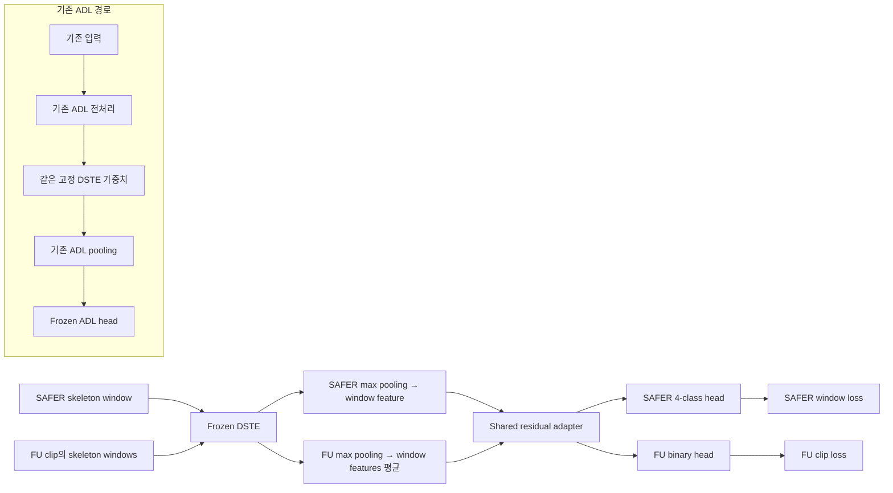

# 고정 DSTE 특징을 이용한 스켈레톤 낙상 분류

- 문서 ID: `DOC-20260929-paper-methods-main-R4`
- 실험 기록 기준일: 2026-09-29
- 문서 수정일: 2026-09-30
- 연구 상태: `in_progress`
- 범위: 실제 수행한 SAFER V3 R3 입력 기반 J0/J1 실험의 입력·모델·연산·학습 절차
- 상세 근거: [방법·실험·재현 조건·한계](2026-09-29_paper_methodology_shared.md)
- 대응 상세본: `DOC-20260929-paper-methodology-R5`

## 3. Methods

### 3.1 Overall framework

본 연구에서는 사전학습된 스켈레톤 인코더 DSTE와 기존 일상행동 분류기를 고정하고,
인코더에서 추출한 특징을 이용하여 낙상 분류 모듈을 학습하였다. 인코더를 $f_\theta$,
기존 일상행동 분류기를 $h_\phi$라 할 때, 낙상 학습에서는 $\theta$와 $\phi$를 최적화 대상에서
제외하였다. 고정 특징은 미리 추출하고 추가한 residual adapter와 데이터셋별 분류기를 학습하였다.
기존 일상행동 분류 경로는 원래의 전처리·pooling·분류기와 추론 모드를 유지하였다.
기존 경로는 $F_{\mathrm{ADL}}(x)=h_\phi(P_{\mathrm{ADL}}(f_\theta(T_{\mathrm{ADL}}(x))))$로
표현하며, $T_{\mathrm{ADL}}$과 $P_{\mathrm{ADL}}$은 각각 해당 경로의 전처리와 pooling이다.

학습에는 SAFER-Activities와 FU-Kinect-Fall을 사용하였다. SAFER에서는 64프레임 window의
중앙 프레임 라벨로 네 클래스 분류를 수행하였다. FU에서는 clip을 구성하는 window 특징을
평균한 뒤 해당 clip의 fall/non-fall 정답으로 이진 분류를 수행하였다. 데이터셋별 특징 집계와
출력층을 유지하고, 집계된 특징에 적용하는 residual adapter를 공유하였다.

비교 모델은 고정 특징 위에 데이터셋별 선형 분류기를 학습한 J0와, 공유 residual adapter를
추가한 J1으로 구성하였다. J1은 선택된 J0 분류기에서 시작하여 adapter와 두 분류기를 함께
학습하였다. 구체적인 초기화와 최적화 설정은 3.5절에 기술한다.

그림의 데이터셋별 출력층은 해당 데이터셋 입력에 적용하였다. 두 DSTE 표기는 같은 고정 가중치를
사용하는 경로를 구별한 것이다. ADL 경로는 기존 pooling을 유지하였고 낙상 학습에는 ADL loss를
사용하지 않았다.

### 3.2 Inputs and supervision units

#### Skeleton input

입력 window는 $X\in\mathbb R^{3\times64\times25\times2}$로 표현한다. 각 축은 XYZ,
시간, 관절, 사람 슬롯이다. 단일 인물 자료에서는 두 번째 슬롯을 0으로 채웠다.
FU의 native 입력은 Kinect-v1의 20관절 측정이다. 이를 proxy25로 배치하고 매 프레임 SpineMid를
중심화한 뒤 첫 프레임의 3D 어깨 방향을 회전 정렬하였다. FU에는 몸통 scale 정규화를 적용하지
않았다. 영점 프레임의 처리와 관절 대응은
[재현 세부사항](2026-09-29_paper_methodology_shared.md#native-fu)에 명시한다.
영상에서 유도한 skeleton은 2D pose를 [MotionAGFormer](https://arxiv.org/abs/2310.16288)로
lifting한 뒤 H36M17에서 proxy NTU25로 변환하였다. H36M17에 없는 손끝·엄지·발끝은 손목·발목
관절로 대체하였다. 이러한 관절은 원 센서의 독립된 25관절 측정과 구분하여 proxy로 표기한다.

SAFER에서는 배포된 ViTPose-H 기반 2D pose를 사용하였다. [SAFER 논문](https://arxiv.org/html/2609.08038v2)
Lifting 입력은 XY를 H36M 순서로 변환하고 confidence는 COCO 순서로 연결하였다.
Confidence를 포함한 3채널을 모델에 전달하였으므로, 좌표와 confidence의 관절 의미가
일치하지 않는 입력 조건이다. 보고된 실험은 이 조건으로 수행하였으며 confidence를 재정렬하지
않았다. 전체 관절 대응과 가상 관절 구성 규칙은
[재현 세부사항](2026-09-29_paper_methodology_shared.md#reproducibility)에 둔다.

Lifting에는 길이 243, 간격 121의 겹친 window를 사용하였다. 좌우 반전 예측을 복원하여 원 예측과
평균하고, 같은 프레임의 여러 예측은 window 중앙에 높은 가중치를 주어 결합하였다.
구간 내 index $u\in\{0,\ldots,242\}$의 가중치는
$w(u)=\max(0.05,1-|u-121|/121)$이다. 규칙적인 마지막 window가 끝에 닿지 않으면
끝맞춤 window를 추가하고, 짧은 sequence는 마지막 pose를 반복하였다.

SAFER의 lifting 기반 proxy NTU25에는 sequence의 유효 몸통 길이 중앙값을 0.5로 맞추는
scale 정규화를 적용하였다. 이후 매 프레임 SpineMid를 중심으로 이동하고, 첫 유효 어깨 방향을
기준으로 yaw를 정렬하였다. 이는 몸통 길이로 정규화한 상대 좌표다. 이 전처리에는 양방향
lifting과 sequence 통계를 사용하였다.

#### SAFER window supervision

SAFER의 25 fps sequence에서 길이 64, 간격 8의 완전한 window를 추출하였다. 불규칙한 끝맞춤
분류 window는 추가하지 않았다. 시작 index가 $s_i$인 window의 정답은 zero-based offset 32의
원본 coarse label $a_{s_i+32}$를 변환하여 얻는다.

$$
y_i^S=\pi(a_{s_i+32}),\qquad
\pi(a)=
\begin{cases}
1,&a=10\quad(\mathrm{fall}),\\
2,&a=11\quad(\mathrm{lie\_down}),\\
3,&a=12\quad(\mathrm{lying\_down}),\\
0,&\text{그 외}\quad(\mathrm{other}).
\end{cases}
\tag{1}
$$

원본 ID와 이름은 [공식 normal label mapping](https://github.com/safer-activities/SAFER-Activities/blob/994ed688ce9e491245ee96c1665e948c6ce6c74d/preprocessing/mappings.json)을
따랐다. ID 11/12는 배포 클래스명을 유지하여 기술한다. `other`는 원본 ID
$\{0,1,\ldots,9,13,14,15\}$를 합친 학습용 클래스이며, ID 0인 `no_label`도 별도 삭제·ignore
처리 없이 포함하였다. 따라서 `other`의 범위는 의미가 확인된 정상 행동만으로 제한되지 않는다.
클래스 의미의 확인 범위와 실제 포함 수는
[라벨 처리 상세](2026-09-29_paper_methodology_shared.md#other-label-policy)에 둔다.

이 모델은 중앙 프레임 정답으로 감독하는 window 분류기다. 정답 시각은 $s_i+32$이고 마지막
입력 관측은 $s_i+63$이다. 두 index 사이 31프레임은 25 fps에서 1.24초이며, 이를 전체 처리 지연이나
endpoint 정답으로 간주하지 않는다.

#### FU clip supervision

FU의 native 30 fps clip은 길이 64, 간격 8의 window로 나누었다. 짧은 clip은 마지막 프레임을
반복하고, 긴 clip의 마지막 정규 window가 끝에 닿지 않으면 끝맞춤 window를 추가하였다.
Clip $i$의 window 수를 $K_i$라
하면, 각 window에서 추출한 특징 $z_{i,k}^F$를 먼저 평균하여 clip 특징을 만든다.

$$
\bar z_i^F=\frac{1}{K_i}\sum_{k=1}^{K_i}z_{i,k}^F.
\tag{2}
$$

낙상 clip을 양성, intentional lying을 포함한 나머지 행동을 음성으로 사용하였다.
Adapter는 $\bar z_i^F$에 적용하였으며 clip 정답을 프레임별 상태 정답으로 복제하지 않았다.
Clip 평균은 window 내부의 시간 표현을 사용하되, 추출된 window 특징 사이의 순서를 별도로
모델링하지 않는다. 식 (2)는 window 특징의 나열 순서에 불변이다.
64프레임의 실제 시간 길이는 SAFER와 FU에서 다르다.

### 3.3 Frozen skeleton representation

특징 추출에는 [FoundSkel의 DSTE](https://arxiv.org/abs/2508.12586)를 사용하였다.
NTU60 cross-subject joint-stream checkpoint를 불러와 고정하고, temporal 입력을 $64\times150$,
spatial 입력을 $50\times192$로 재배열하였다. 고정 인코더의 출력과 pooled 특징은 다음과 같다.

$$
(H_T,H_S)=f_\theta(X),\qquad
H_T\in\mathbb R^{64\times1024},\quad
H_S\in\mathbb R^{50\times1024},
\tag{3}
$$

$$
z=\left[\max_{t\in\mathcal T_X}H_T(t);\ \max_{v=1,\ldots,50}H_S(v)\right]
\in\mathbb R^{2048}.
\tag{4}
$$

Max 연산은 각 feature channel별로 수행한다. $\mathcal T_X$는 SAFER의 완전한 window와
FU의 길이 64 window에서는 모든 시간 위치이고, FU의 짧은 clip에서는 실제 관측 길이에 해당하는
위치다. 짧은 clip의 padding은 인코더 입력에는 포함된다. Spatial max에는 별도의 관측 마스크를
적용하지 않았다. Spatial max는 두 번째 사람 슬롯에 대응하는 출력 token도 포함하였다.
Temporal pooling의 위치 제한은 인코더 내부 attention에 대한 padding mask와 구분한다.

식 (4)는 낙상용 특징의 readout이다. 기존 ADL은 자신의 전처리와 temporal 64/spatial 50 전체
max pooling을 유지한 $z_{\mathrm{ADL}}$에 $h_\phi$를 적용하였다. FU의 짧은 clip에 사용하는
실제 길이 제한은 ADL 경로에 적용하지 않았다. 낙상 학습의 optimizer에서 $\theta,\phi$를
제외하고 고정 특징을 미리 추출한 후 추가 모듈만 학습하였다.

### 3.4 Shared residual adaptation

두 데이터셋의 집계된 특징에 동일한 residual adapter를 적용하였다. Adapter의 bottleneck
차원은 256으로 설정하였다. SAFER에는 window 특징 $q=z_i^S$, FU에는 clip 평균 특징
$q=\bar z_i^F$를 입력하였고, LayerNorm·선형층·GELU·dropout·잔차 덧셈을 다음과 같이 구성하였다.

$$
u(q)=\operatorname{GELU}\left(W_{\mathrm{down}}\operatorname{LN}(q)+b_{\mathrm{down}}\right),
\tag{5}
$$

$$
A_\psi(q)=W_{\mathrm{up}}\operatorname{Dropout}_{0.1}(u(q))+b_{\mathrm{up}},
\qquad q'=q+A_\psi(q).
\tag{6}
$$

Down-projection은 2048→256, up-projection은 256→2048이며 LayerNorm과 bias를 포함한
adapter 파라미터 수는 1,054,976개다. 두 데이터셋은 같은 $\psi$를 사용하고 출력층을 구분하였다.
SAFER head는 8,196개, FU head는 4,098개 파라미터를 가지므로 J1의 전체 학습 파라미터 수는
1,067,270개다. J0의 두 head 합계는 12,294개다. 고정 DSTE와 ADL의 파라미터는 이 수에서 제외한다.

$$
\ell_S(q)=W_Sq'+b_S\in\mathbb R^4,\qquad
\ell_F(q)=W_Fq'+b_F\in\mathbb R^2,\qquad
p_d(q)=\operatorname{softmax}(\ell_d(q)).
\tag{7}
$$

식 (7)은 J1의 출력 계산을 나타낸다. J0에서는 residual adapter를 사용하지 않고, 동일한 차원의
입력 특징 $q$를 각 데이터셋의 선형 분류기에 직접 전달하였다.

평가에서는 SAFER 입력에 4-class head를, FU 입력에 binary head를 적용하였다.
외부 RGB 기술검사에서 사용한 별도의 G0/G1/G2 head는 상세본의 확장 실험에 기술한다.

FU에서 평균 이후에 비선형 adapter를 적용하는 순서는 window마다 adapter를 적용한 뒤 평균하는
순서와 일반적으로 같지 않다. 실제 학습에는 평균 후 adapter를 적용하였으며,
별도의 domain-alignment loss는 사용하지 않았다.

J0의 두 head는 독립 파라미터로 학습하였다. J1에서는 두 데이터셋의 손실로 공유 adapter를
갱신하고 각 head는 해당 데이터셋의 손실로 갱신하였다.

### 3.5 Training objective and optimization

#### Dataset-specific weighted classification loss

데이터셋 $d\in\{S,F\}$의 클래스 수를 $C_d$, 현재 학습 split의 클래스 빈도를 $n_c^{(d)}$라
하자. SAFER에서는 window 수, FU에서는 해당 학습 fold의 clip 수로 빈도를 계산하였다.

$$
\tilde w_c^{(d)}=\frac{1}{\sqrt{\max(n_c^{(d)},1)}},\qquad
w_c^{(d)}=\frac{\tilde w_c^{(d)}}{C_d^{-1}\sum_{j=0}^{C_d-1}\tilde w_j^{(d)}}.
\tag{8}
$$

각 batch $B_d$의 손실은 weighted-mean cross-entropy로 정의한다.

$$
\mathcal L_d=-\frac{\sum_{i\in B_d}w_{y_i}^{(d)}\log p_{d,y_i}(q_i)}
{\sum_{i\in B_d}w_{y_i}^{(d)}},\qquad
\mathcal L=\mathcal L_S+\mathcal L_F.
\tag{9}
$$

검증·평가 표본의 클래스 빈도는 사용하지 않았다. 각 데이터셋의 weight를 mean-one으로 바꾸는
공통 배율은 식 (9)의 분자와 분모에서 상쇄된다. 두 손실의 계수를 1로 설정하지만 표본 수,
손실값 또는 gradient 크기가 같다는 뜻은 아니다.

한 학습 step에서 SAFER batch와 FU batch를 하나씩 사용하였다. SAFER 학습 집합을 한 번
순회하는 것을 한 epoch로 정의하고, FU의 학습 clip은 독립적으로 섞어 반복 순회하였다.
SAFER의 마지막 작은 batch는 유지하고 FU는 새 permutation을 이어 붙여 매 step 32개를
채웠다. 한 epoch는 75번의 optimizer update와 FU 2,400개 표본 노출에 해당하였다.

#### Two-stage optimization

첫 단계에서는 adapter 없이 두 선형 head를 학습하였다. 두 번째 단계에서는 첫 단계에서 선택한
head를 복사하고 새로운 adapter를 추가하였다. Up-projection의 weight와 bias를 0으로 초기화하므로
초기에는 $A_\psi(q)=0$이며 같은 입력의 J1 낙상 logits가 선택된 J0와 일치한다.
이후 adapter와 두 head를 함께 학습하였다. J1 epoch 0도 선택 후보에 포함하였다.
각 단계에서 optimizer를 새로 생성하였으며 J0의 AdamW moment를 J1에 이전하지 않았다.

두 단계 모두 AdamW를 사용하였다. Head의 초기 learning rate는 J0에서 $10^{-3}$,
J1에서 $5\times10^{-5}$로 설정하고, J1 adapter에는 $10^{-4}$를 적용하였다.
Weight decay는 $10^{-4}$, betas는 $(0.9,0.999)$, epsilon은 $10^{-8}$로 설정하였다.
SAFER와 FU batch 크기는 각각 8192와 32, seed는 0으로 설정하였다.
최대 선택 예산은 J0 30 epoch와 J1 20 epoch로 두었으며, learning rate는 J0의 20·25 epoch 완료 후,
J1의 12·16 epoch 완료 후 각각 0.1배로 줄였다.

J1의 공유 adapter에 대한 gradient는
$\nabla_\psi\mathcal L=\nabla_\psi\mathcal L_S+\nabla_\psi\mathcal L_F$로 계산하며,
두 데이터셋의 감독 정보를 최적화에 함께 반영한다.

모델 선택과 평가 분할, nested 초기화, 5개 모델 ensemble, 최종 단일 모델의 학습 횟수는
[Experimental setup에 해당하는 상세 절](2026-09-29_paper_methodology_shared.md#evaluation)에
별도로 기술하였다. G0/G1/G2 추가 특징 비교, S0-A 상태 분류 학습·평가, 외부 RGB 연결 검사는
각각 별도 실험으로 수행하였으며 [확장 실험](2026-09-29_paper_methodology_shared.md#extensions)과
[해당 결과](2026-09-29_paper_methodology_shared.md#results)에 기술하였다.
