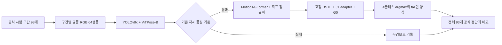

# OmniFall GMDCSA24-CS 공식 시험 구간 비교

- 문서 ID: `DOC-20261002-omnifall-gmdcsa-benchmark-R1`
- 기준일: 2026-10-02
- 상태: `completed`

## 1. 연구 질문과 비교 단위

**공개된 시험 구간과 정답을 고정했을 때, 현재 모델이 외부 데이터의 낙상 동작을 얼마나
정확하게 분류하는지 평가한다.** OmniFall의 `gmdcsa24-cs test`를 사용하고, 기존 모델은
OmniFall 논문 v3 Table 3의 보고값으로 비교한다. 기존 모델을 이번에 다시 학습하거나
실행한 것으로 표현하지 않는다.

시험 대상은 Subject 4의 **37개 영상에 포함된 93개 행동 구간**이다. `fall` 17개를 양성,
나머지 76개를 음성으로 처리한다. 공식 시험 영상 목록과 라벨 CSV, 실제 configuration이
반환하는 시험 표본을 대조해 이 구성이 일치함을 확인했다.
[공식 configuration](https://huggingface.co/datasets/simplexsigil2/omnifall/blob/83572a37b9e3081df8c06a56874b1d1f2a19386c/CONFIGS.md),
[시험 목록](https://huggingface.co/datasets/simplexsigil2/omnifall/blob/83572a37b9e3081df8c06a56874b1d1f2a19386c/splits/cs/gmdcsa24/test.csv),
[구간 정답](https://huggingface.co/datasets/simplexsigil2/omnifall/blob/83572a37b9e3081df8c06a56874b1d1f2a19386c/labels/GMDCSA24.csv).

원 데이터는 GMDCSA-24이지만, 이번 시험에서는 **OmniFall의 분할과 재주석**을 사용한다.
원 데이터 논문의 다른 평가 조건이나 영상 단위 낙상 라벨로 대체하지 않는다.
[원 데이터 논문](https://doi.org/10.1016/j.dib.2024.110892).

| 평가 조건 | 이번 실험의 정의 |
| --- | --- |
| 입력 단위 | 정답 시작·종료 시각이 제공된 행동 구간 하나 |
| 예측 단위 | 각 구간에 대한 예측 하나 |
| 양성 | `fall`: 넘어지는 동작 |
| 음성 | `fallen`, `lie_down`, `lying`을 포함한 나머지 모든 클래스 |
| 주요 지표 | Fall recall/sensitivity, specificity, Fall F1 |
| 학습 | 기존 가중치 고정; 이 시험 자료로 학습·보정하지 않음 |
| 실패 처리 | 품질 기준 미통과는 무경보로 기록하고 전체 분모에 유지 |

이는 **정답 구간이 주어진 분류 평가**이다. 연속 영상에서 낙상 시점을 찾아내는 사건 검출,
낙상 이후 회복 판단, OmniFall 전체 16클래스 분류의 성능을 측정한 결과가 아니다.
특히 `fallen`을 `fall`과 합치지 않는다.
[공식 라벨 정의](https://huggingface.co/datasets/simplexsigil2/omnifall/blob/83572a37b9e3081df8c06a56874b1d1f2a19386c/LABELS.md).

## 2. 사전에 고정한 모델 적용 방법

### 2.1 구간을 64개 샘플로 변환

공식 companion package 0.2.0의 `uniform` 모드로 각 구간에서 RGB 64장을 선택한다.
시작·종료 시각을 포함한 균등한 요청 시각마다 가장 가까운 프레임을 사용한다. 이는 구간의
전체 길이를 64개 샘플로 표현하는 **시간 정규화**이며, 원영상의 물리적 25 fps를 유지하는
처리가 아니다. 긴 구간은 간격을 두고 읽고, 짧은 구간은 같은 원프레임이 반복될 수 있다.
[공식 companion package](https://pypi.org/project/omnifall/0.2.0/).

실제 검사에서 93개 중 61개 구간에 반복 프레임이 있었고, 구간당 고유 프레임은 최소 21장이었다.
공식 로더의 출력 93 × 64장을 원영상의 순차 디코딩 결과와 대조해 픽셀과 시간 대응을 확인했다.
가장 가까운 프레임을 고르는 규칙 때문에 일부 프레임은 구간 경계를 최대 약 23.87 ms 벗어났다.
이를 숨기거나 모든 프레임이 엄격하게 정답 구간 안에 있다고 기술하지 않는다.

### 2.2 고정된 전처리와 분류기

YOLOv8x로 사람을 검출하고 ViTPose-B로 COCO 17관절을 추정한다. 추적 상태는 매 구간
초기화한다. 기존 품질 기준은 검출 coverage 0.8 이상, 자세 coverage 0.8 이상,
양쪽 hip confidence의 작은 값에 대한 구간 중앙값 0.3 이상이다.

기준을 통과한 입력에는 기존 MotionAGFormer의 3D lifting, 좌표 정규화, DSTE 특징 추출을
적용한다. 고정 J1 residual adapter를 거친 특징은 별도로 학습된 **G0 4클래스 분류기**에
입력한다. J1 adapter는 SAFER/FU 공동학습 결과이고, G0는 그 특징을 고정한 상태에서
SAFER로 학습한 분류기이다. 이번 시험으로 가중치를 갱신하지 않는다.

MotionAGFormer의 243샘플 입력은 마지막 자세를 반복해 채우며, 원래의 64개 입력 위치에
해당하는 출력만 유지한다. 기존 구현은 COCO→H36M 변환에서 관절 좌표만 재배열하고
confidence는 기존 순서를 유지한다. 이 대응 정책도 이번 평가에서 수정하지 않았으며,
입력 표현의 기존 제약으로 남아 있다.

각 구간은 DSTE의 64샘플 입력 하나이므로 예측도 하나다. 4클래스 출력 중 `fall`이 argmax인
경우만 양성으로 정한다. 확률 임계값 탐색, 여러 window의 경보 합치기, 사건 decoder는
사용하지 않는다. 추가 global-motion 특징과 G1/G2 출력은 이번 비교의 판정에 사용하지 않는다.

품질 기준 미통과 구간은 분류기를 실행하지 않고 **무경보**로 처리한다. 이때 양성 구간이면
FN, 음성 구간이면 TN에 포함되므로 처리 실패의 양성·음성 개수를 반드시 별도로 제시한다.

### 2.3 지표

\[
\mathrm{Recall}=\frac{TP}{TP+FN},\qquad
\mathrm{Specificity}=\frac{TN}{TN+FP},\qquad
\mathrm{F1}=\frac{2TP}{2TP+FP+FN}.
\]

세 지표의 분모는 공식 시험 전체를 기준으로 하며, 전처리 성공 표본만 선택한 지표로
바꾸지 않는다. 위 식은 표준 이진 분류 지표의 정의이며 본 연구가 새로 제안한 수식이 아니다.

## 3. 동일 시험 분할의 비교 결과

| 모델 | 낙상 과제 학습 출처 | Recall / Sensitivity | Specificity | Fall F1 | 결과 출처 |
| --- | --- | ---: | ---: | ---: | --- |
| Qwen3-VL-8B | 과제별 추가 학습 없는 zero-shot | 58.8% | 94.7% | 64.5% | 논문 보고값 |
| InternVL3.5-8B | 과제별 추가 학습 없는 zero-shot | 58.8% | 92.1% | 60.6% | 논문 보고값 |
| VideoMAE-K400 | CMDFall CS | 64.7% | 89.5% | 61.1% | 논문 보고값 |
| VideoMAE-K400 | OF-Synthetic Ra | 52.9% | 97.4% | 64.3% | 논문 보고값 |
| **Ours: fixed RGB → J1 adapter → G0** | SAFER/FU adapter + SAFER G0 | **29.4%** | **93.4%** | **37.0%** | 이번 직접 실행·검산 |

기존 네 행은 [OmniFall v3 Table 3](https://arxiv.org/html/2505.19889v3)의 GMDCSA `Fall` 열에서
확인했다. **세 종류 모델의 네 설정**이며 서로 다른 네 논문의 결과가 아니다.
기존 모델의 원예측을 확보해 독립 검산한 값으로 표현하지 않는다.

위 네 설정은 낙상 과제 학습에 GMDCSA를 포함하지 않은 비교군이다. 같은 표의
OF-Staged 및 OF-Staged+Synthetic 학습 행은 GMDCSA 학습 데이터를 포함하므로 별도 조건이다.
Zero-shot은 과제별 추가 학습이 없다는 뜻이며, 사전학습 자료와 시험 영상의 중복이 전혀
없다는 보장을 뜻하지 않는다.

## 4. 직접 실행 결과와 오류 분석

**현재 고정 모델의 Fall F1은 37.04%이며, 위 네 비교 설정의 논문 보고값보다 낮다.**
수치가 높게 나온 사례만 모은 비교표로 사용하지 않고, 이번 외부 평가의 실패도 그대로 보고한다.

| 실제 정답 \ 모델 판정 | 낙상 | 비낙상·무경보 | 합계 |
| --- | ---: | ---: | ---: |
| 낙상 | TP 5 | FN 12 | 17 |
| 비낙상 | FP 5 | TN 71 | 76 |
| 합계 | 10 | 83 | 93 |

전체 93개 기준의 재현율은 **29.41%**, 특이도 **93.42%**, 정밀도 **50.00%**, F1 **37.04%**이다.
추가 지표는 정확도 **81.72%**, Fall score의 AP **62.07%**이다. AP는 이번 모델의 보조 지표이며
위 비교 논문의 F1과 서로 대체해서 비교하지 않는다. 실패 입력의 AP score는 사전에 정한 0이다.

자세 품질 기준 통과는 91/93개이고, 실패 2개는 모두 음성이다. 따라서 낙상 17개는 모두
분류까지 수행됐다. **FN 12개는 품질 gate에서 제거된 사례가 아니라 통과 후 놓친 사례**다.
다만 품질 기준을 통과했다는 사실만으로 2D·3D 자세가 정확하다고 보장되지는 않는다.

| 공식 정답 종류 | 구간 수 | 낙상으로 판정한 수 | 해석 |
| --- | ---: | ---: | --- |
| fall | 17 | 5 | 12개 미검출 |
| lie_down | 3 | 3 | 세 구간 모두 낙상으로 오인 |
| other | 14 | 2 | 오경보 2개 |
| fallen | 17 | 0 | 이번 Fall-only 평가에서 모두 음성 |
| 그 밖의 음성 클래스 | 42 | 0 | walk, sit_down, sitting, lying, stand_up, standing |

오경보 5개 중 3개가 의도적으로 눕는 동작에서 발생했다. 따라서 **이 시험 결과는 외부 영상에서
낙상과 의도적 눕기를 잘 구별한다는 주장을 뒷받침하지 않는다.** `fallen`에 경보를 내지 않은
결과 역시 회복 상태를 인식하거나 낙상 이후의 상황을 이해했다는 증거가 아니다.

정확도 81.72%는 전부 비낙상으로 답했을 때의 76/93과 같다. 이 데이터에서 정확도만 제시하면
낙상을 놓치는 문제를 가릴 수 있으므로 혼동행렬과 낙상 재현율·F1을 함께 보고한다.

## 5. 검산한 범위

- **시험 대상:** 공식 시험 목록·Parquet·라벨 CSV의 37영상, 93구간과 순서를 대조했다.
- **입력:** 모든 구간의 64개 RGB 샘플을 원영상 순차 디코딩의 픽셀·시간과 대조했다.
- **누락 여부:** 2개 품질 실패를 포함해 93개 전부를 집계했고, 실패의 양성·음성을 분리했다.
- **가중치:** 각 추론 단계의 전후 가중치가 동일함을 확인했다.
- **분류 출력:** 유효 91개 전부에서 저장된 DSTE 특징에 adapter와 G0를 CPU로 독립 적용했다.
  GPU 결과와 argmax가 모두 같았고, G0 logit의 최대 절대 차이는 약 4.77×10⁻⁶이었다.
- **지표:** 독립 집계에서 혼동행렬, recall, specificity, precision, F1, accuracy, AP가 일치했다.

이 검산은 수치의 산출 근거와 구현 일관성을 확인한다. 전체 RGB 전단부터 DSTE까지를
두 번째 독립 구현으로 재실행한 검증은 아니며, 라벨의 완전성이나 광범위한 일반화까지
증명하지 않는다. 낮은 결과를 확인한 뒤 head·sampling·판정 규칙을 바꾸지 않았다.

## 6. 실제 사례 그림과 비교 자료

GMDCSA24 공식 구간의 실제 TP·TN·FP·FN 사례 (공개 사본 미포함)

각 유형에서 공식 표본 순서상 첫 사례를 선택했다. 동일 구간의 세 시점에 대한 실제 RGB,
추정 2D 관절과 해당 구간의 분류 점수를 표시한다. 신뢰도나 외관이 좋은 사례를 선택한
그림이 아니며, 사후 설명용 사례이므로 전체 성능의 별도 증거로 취급하지 않는다.
표시한 자세는 모델의 추정값이고 정답 자세가 아니다.

- [비교표 CSV](2026-10-02_omnifall_comparison.csv)
- 사례 그림 PDF (공개 사본 미포함)
- 사례 그림 SVG (공개 사본 미포함)
- [논문·데이터·공식 로더 BibTeX](2026-10-02_omnifall_benchmark_references.bib)

## 7. 논문에서 주장할 수 있는 범위

이 표는 동일 시험 구간에서의 **시스템 비교**로 사용할 수 있다. 다만 학습 자료, 사전학습,
출력 클래스 수와 입력 샘플링이 다르므로 성능 차이를 adapter 하나의 효과로 설명하지 않는다.
비교 모델은 16클래스 예측에서 이진 지표를 산출하고, 현재 모델은 4클래스 예측에서
이진 판정을 산출한다.

시험 피험자는 한 명이고 93개 구간은 37개 영상에 묶여 있다. 93개의 독립 피험자를 평가한
것처럼 해석하거나 이 표만으로 광범위한 일반화·통계적 우월성을 주장하지 않는다.
정답 구간이 입력에 제공되므로 연속 감시 성능보다 제한된 과제이다.

기존 [URFD 전체 영상 평가](2026-10-02_paper_evidence_review_shared.md)와는 입력 단위와
샘플링, 경보 집계가 다르다. 두 데이터셋의 숫자 차이를 새 모델의 개선량으로 해석하지 않는다.
현재 문서 기반 재구현 가중치의 새 평가이며 소실된 과거 실험의 수치 재현이라고 주장하지 않는다.

현재 결과가 낮은 원인이 RGB 자세 추정, 3D 변환, 시간 정규화, 학습 도메인 차이 중 무엇인지
이 한 번의 실행으로 분리할 수는 없다. 확인된 결론은 **고정된 현재 파이프라인이 이 시험에서
낙상 동작을 많이 놓치고, 의도적 눕기에도 오경보를 냈다**는 것이다.

논문 Results에는 다음처럼 기술할 수 있다.

> OmniFall의 GMDCSA24-CS 공식 시험 93구간에 고정 모델을 적용하였다. Fall-only 평가에서
> sensitivity 29.41%, specificity 93.42%, F1 37.04%를 얻었다. 낙상 17구간 중 5구간을
> 검출했으며, 비낙상에서 오경보 5건이 발생했다. 자세 품질 기준에 미달한 비낙상 2구간은
> 무경보로 처리하되 전체 평가에 포함하였다. 이 결과는 외부 구간 분류에서 현재 시스템의
> 제한적인 전이 성능을 보이며, 낙상과 의도적 눕기의 구분에 어려움이 남아 있음을 나타낸다.
