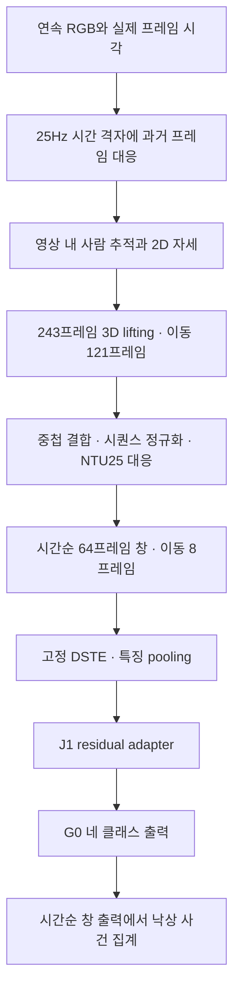

# 현재 모델의 시간 입력 구조와 평가 입력 감사

- 문서 ID: `DOC-20261002-temporal-input-audit-R1`
- 기준일: 2026-10-02
- 상태: `completed` — 저장 입력 감사 완료, 전처리 수정·재평가 미실행

## 1. 확인 결과

현재 DSTE–J1–G0 모델은 **시간 순서가 보존된 64프레임 스켈레톤 창**을 입력받는다.
검사한 저장 입력에서 창 내부의 시간 순서 역전은 발견되지 않았다.
그러나 순서 보존만으로 학습 때와 같은 시간 입력이 보장되지는 않는다.

이번 감사에서 다음 두 가지 차이를 확인했다.

1. 최근 GMDCSA24·Le2i·CAUCAFall의 정답 구간 평가는 길이가 다른 각 구간에서 64장을 뽑았다.
   시간 순서는 유지하지만 동작의 시간 간격과 앞뒤 문맥이 원래 연속 입력과 달라졌다.
2. Le2i 연속 평가에서는 부동소수점 시각 비교로 인해 일부 위치에서 한 프레임 이전 것을 선택했다.
   시간 역전은 없지만 불필요한 반복·누락이 생겼다.

두 현상을 실제 입력에서 확인했다는 것과 이들이 성능 하락을 얼마나 설명한다는 것은 별개의 주장이다.
수정한 입력으로 다시 평가하지 않았으므로 성능 변화의 크기나 방향은 아직 확인하지 않았다.

## 2. 원래 연속 처리의 구성

현재 선택된 분류 경로는 DSTE → J1 residual adapter → G0다.
별도의 상태·회복 모델은 이 경로에 포함되지 않는다.

이 도식은 저장된 연속 처리 방식이다. 첫 단계의 시각 비교 문제는 5절에 별도로 기록한다.
243프레임은 **2D→3D 변환에 사용하는 문맥 길이**, 64프레임은 **DSTE 분류 입력 길이**다.
두 길이를 같은 창으로 해석해서는 안 된다.

64프레임 창은 다음과 같이 생성된다. 프레임 번호는 0부터 시작한다.

| 창 | 입력 프레임 | 25Hz 격자의 시각 범위 | 학습 정답 프레임 |
| --- | --- | --- | ---: |
| 1 | 0, 1, …, 63 | 0.00–2.52초 | 32 |
| 2 | 8, 9, …, 71 | 0.32–2.84초 | 40 |
| 3 | 16, 17, …, 79 | 0.64–3.16초 | 48 |

창 내부의 첫·끝 프레임 간 시간은 63/25=2.52초이며, 창은 0.32초씩 이동한다.
일반적으로 말하는 64/25=2.56초 분량과 첫·끝 시각 차이의 정의를 구별한다.
모델 입력은 `(배치, 좌표3, 시간64, 관절25, 사람2)`이며, 현재 단일 인물 입력에서 두 번째 사람은 0이다.

## 3. 시간 정보를 학습하는 위치와 shuffle의 의미

DSTE는 64개 시간 위치에 위치 인코딩을 적용하여 스켈레톤의 시간 정보를 처리한다.
그 뒤 temporal·spatial 출력을 pooling하여 2048차원 특징을 만들고, J1과 G0가 이를 처리한다.
pooling 전에 이미 시간 위치를 반영하므로 프레임 순서를 바꾼 입력이 동등하다고 볼 수 없다.
또한 분류기는 실제 초 단위 timestamp를 별도 입력으로 받지 않는다. 시간 간격 변경을 자동 보정한다고
가정할 수 없다.

현재 J1과 G0는 **이전 창의 hidden state를 다음 창으로 넘기는 순환 모델이 아니다.**
각 창의 특징으로 독립적인 출력을 만든다. 학습 중 shuffle은 cached feature 표본의 행 순서에
적용하며, 64프레임 내부의 순서를 무작위로 바꾸지 않는다.

따라서 두 종류의 순서를 구분해야 한다.

- **창 내부의 프레임 순서:** 동작 입력의 의미를 구성한다. 보존해야 한다.
- **독립 창을 학습시키는 순서:** 현재 J1/G0 학습에서 섞을 수 있다.

영상 추적, 전체 시퀀스 3D 처리, 낙상 사건 집계에는 영상의 시간축이 필요하다.
같은 특징을 독립적으로 분류할 수 있다는 사실이 영상 전체를 임의로 섞어 처리해도 된다는 뜻은 아니다.

## 4. 최근 구간 평가가 달랐던 점

최근 세 데이터셋 구간 평가에서는 정답으로 제공된 시작·끝 시각 사이를 균등 분할하여 64장을 선택했다.
길이가 D초인 구간의 요청 시각 간격은 D/63초다. 구현에서 지정한 `target_fps=25`는
공식 decoder의 `uniform` 모드에서는 사용되지 않는다.

| 항목 | 연속 입력 | 최근 정답 구간 입력 |
| --- | --- | --- |
| 처리 단위 | 영상 전체 | 정답으로 잘라낸 각 구간 |
| 샘플링 시간 | 25Hz 격자 | 구간 전체를 64개 위치로 균등 분할 |
| 64프레임의 시각 범위 | 격자상 2.52초 | 구간 길이에 따라 달라짐 |
| 사람 추적 | 영상 내에서 이어짐 | 구간마다 초기화 |
| 3D 입력 문맥 | 긴 영상에 243프레임 창을 이동 | 샘플64 뒤에 마지막 자세179개를 반복하여243 구성 |
| 정규화 기준 | 영상 시퀀스 | 각 구간 시퀀스 |
| DSTE 창 | 영상에서64/8로 여러 창 | 구간당 하나 |
| 평가 단위 | 사건 또는 영상 | 정답 구간 |

연속 영상도 243프레임보다 짧으면 끝 프레임을 반복한다. 차이는 최근 구간 방식에서는
구간의 원래 길이와 무관하게 **모든 분류 통과 구간이 먼저64장으로 바뀐다**는 점이다.
179개 패딩은 lifting 입력243의 약73.7%이며, 이후 유효한64개 출력만 사용한다.

저장 입력의 확인 결과는 다음과 같다. 반복은 같은 원본 프레임을 여러 위치에 사용한 경우다.

| 데이터셋 | 검사 구간 | 반복 포함 구간 | 구간별 최소 고유 프레임 수 | 낙상 구간 길이 중앙값 |
| --- | ---: | ---: | ---: | ---: |
| GMDCSA24 | 93 | 61 | 21 | 1.32초 |
| Le2i | 203 | 121 | 8 | 약1.97초 |
| CAUCAFall | 47 | 25 | 11 | 2.40초 |

343개 구간의 총21,952개 입력 위치에서 프레임 번호와 시각이 비감소함을 확인했다.
예를 들어 1.32초 동작 전체를64장으로 입력하면 학습의 25Hz 계약에서 약2.52초에 해당하는
위치 수를 차지한다. 시간 위치 기준으로 약1.91배 늘어진 효과가 생길 수 있다.
이는 동작 전후 문맥을 유지한 연속64프레임을 넣는 것과 다르다.

이 구간 입력은 벤치마크를 연결하면서 추가한 별도 조건이다. 공식 시험 목록을 사용한다는 이유만으로
사용자 모델의 원래 전처리를 이 방식으로 바꿔야 하는 것은 아니다. 기존 구간 평가 결과에는 이 차이를
명시해야 하며, 원래 연속 처리와 동일한 조건의 결과로 설명해서는 안 된다.

## 5. 연속 Le2i 입력에서 발견한 시각 비교 문제

과거 프레임만 고르는 계산에서 사실상 같은 시각이 다르게 표현된 사례가 있었다.
예를 들어 목표 시각이 1.4초이고 원본 프레임 시각이 1.4000000000000001초라면,
엄격한 비교가 해당 프레임을 미래로 취급하여 이전 프레임을 선택했다.

실제 사례의 선택 원본 번호는 `33, 34, 34, 36, 37`이었다.
순서는 뒤집히지 않지만 프레임34가 반복되고35가 빠진다.
시각을 정수 나노초로 표현하여 비교한 진단에서 다음 범위를 확인했다.

| 평가 범위 | 영향 영상 | 한 프레임 이전 것으로 선택된 입력 위치 |
| --- | ---: | ---: |
| Le2i 기존127영상 | 67 | 3,141 |
| Le2i 공식 시험38영상 | 29 | 1,638 |
| URFD의 유효69영상 | 0 | 0 |

Le2i 두 목록은22영상이 겹치므로 영향 수를 독립 표본처럼 합치지 않는다.
약24fps 영상을25Hz로 대응할 때 필요한 정상적 프레임 반복과 이 수치 오차를 구분했다.
이는 영상 sampling 구현에서 확인한 문제이며, 모델의 일반화 능력 자체에 대한 결론은 아니다.
이번 감사에서는 기존 입력과 결과를 보존했고, 정수시각 진단으로 모델을 다시 실행하지 않았다.

## 6. 확인 범위와 시간 해석의 한계

SAFER 학습·검증·시험·OOD의497시퀀스에 연결된 **1,007,723개 창**에서 시퀀스 경계,
64프레임 범위, stride8과 중심 정답 offset32를 검사했다. 이 중 학습 창은609,183개다.
원본 학습 영상의 모든 timestamp와 스켈레톤 수치의 의미적 정확도를 새로 검증한 것은 아니다.

연속 평가에서는 Le2i127·Le2i38·URFD70 목록을 확인했다. URFD의 timestamp가 누락된 한 영상은
기존 방침대로 처리 실패에 포함했다. 나머지234개 mapping과 분류가 수행된5,555개 창의
저장 인덱스·시각·끝점을 검사했다. 이 수에는 Le2i의 중복 평가 범위가 포함된다.

학습은 창의32번 위치를 정답으로 사용하지만, Le2i 사건 평가의 경보 시각은63번 끝점이다.
둘 사이의 차이는1.24초다. 이는 정답 위치와 경보 시각의 정의 차이이며, 단독으로 모델 오류 또는
전체 시스템의 실제 실행 지연이라고 해석하지 않는다.

또한 현재3D 변환은 긴 문맥과 중첩 결합을 사용하고, 정규화와 품질 판정은 전체 입력 시퀀스를 참조한다.
따라서 **시간순 입력은 확인되었지만, 전체 파이프라인이 미래 프레임 없이 동작하는 실시간 시스템으로
검증된 것은 아니다.** 현재 결과는 해당 offline 처리 조건으로 기술해야 한다.

## 7. 평가를 이어갈 때 유지할 기준

원래 모델의 연속 입력 성능을 확인하려면 실제 시각의 수치 비교를 정리하고, 영상 내 추적과3D 문맥을
유지한 뒤64/8 창을 생성하는 입력 계약부터 고정해야 한다. 이후 기존 결과를 보존한 별도 평가에서
같은 모델·같은 영상·같은 평가 단위로 비교해야 입력 변경의 영향을 판단할 수 있다.

구간 분류 F1과 사건 검출 F1이 달라졌다는 것만으로 성능 변화가 시간축 수정 때문이라고 결론낼 수 없다.
이번 검사는 입력 차이와 구현 문제의 확인까지 완료했으며, 성능 개선의 실험적 확인은 수행하지 않았다.
